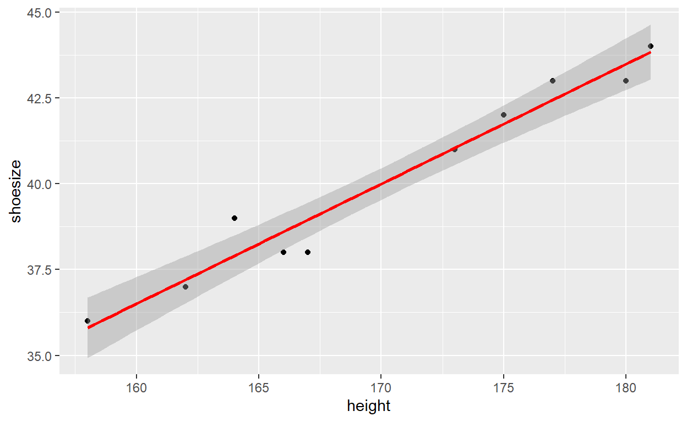
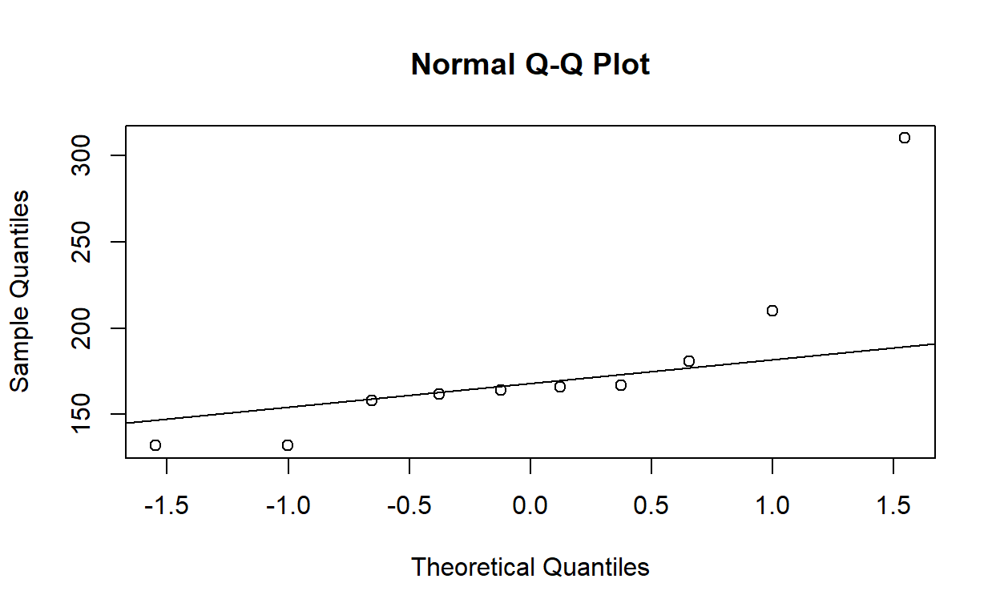

<div class="layout-chunk" data-layout="l-body">
`<a href="data:text/x-markdown;base64,LS0tDQp0aXRsZTogIlN0YXRpc3RpY3MiDQotLS0NCg0KYGBge3IgZXZhbCA9IFRSVUUsICBtZXNzYWdlPUYsIGluY2x1ZGU9Riwgd2FybmluZz1GLCBwdXJsPUYsIHJlc3VsdHM9ImhpZGUifQ0Ka25pdHI6OnB1cmwoJ3N0YXRpc3RpY3MuUm1kJywgZG9jdW1lbnRhdGlvbiA9IEYpDQpgYGANCg0KYGBge3IgZWNobz1GQUxTRSwgcHVybD1GfQ0KeGZ1bjo6ZW1iZWRfZmlsZSgnc3RhdGlzdGljcy5SbWQnKQ0KYGBgDQoNCmBgYHtyIGVjaG89RkFMU0UsIHB1cmw9Rn0NCnhmdW46OmVtYmVkX2ZpbGUoJ3N0YXRpc3RpY3MuUicpDQpgYGANCg0KIVtdKEZpZ3VyZXMvU2FkaXN0aWNzLnBuZykNCg0KYGBge3IsICBldmFsPVQsIHdhcm5pbmc9RiwgbWVzc2FnZT1GfQ0KbGlicmFyeSAocHN5Y2gpDQpsaWJyYXJ5KGdncGxvdDIpDQpsaWJyYXJ5KGRwbHlyKQ0KbGlicmFyeShncmlkRXh0cmEpDQpsaWJyYXJ5KGNhcikNCmBgYA0KDQojIERlc2NyaXB0aXZlDQoNCiMjIEJhc2ljIGRlc2NyaXB0aW9uDQoNCldlIHdpbGwgZ28gYmFjayB0byBvdXIgZHVtbXkgYHN0dWRlbnRzYCBkYXRhIHNldC4gRG8ga25vdyBhYm91dCB0aGUgcGl2b3QgdGFibGUgZnVuY3Rpb25hbGl0eSBpbiBleGNlbD8gV2UgYWxyZWFkeSBtZW50aW9uZWQgdGhhdCB0aGUgc2FtZSBjb3VsZCBiZSBlYXNpbHkgYWNjb21wbGlzaGVkIGluIFIgc3VjaCBhcyBoZXJlIHVzaW5nIHRoZSBmdW5jdGlvbnMgIGFzIGBkZXNjcmliZWAgb3IgYGRlc2NyaWJlQnlgLiANCg0KYGBge3IsICBldmFsPVR9DQpzdHVkZW50czwtcmVhZC50YWJsZSgnaHR0cHM6Ly93d3cuZGlwaW50b3RoZXJlZWYuY29tL3VwbG9hZHMvMy83LzMvNS8zNzM1OTI0NS9zdHVkZW50cy50eHQnLGhlYWRlcj1ULCBzZXA9Ilx0IiwgZGVjPScuJykgIyBpbnNwZWN0IHRoZSBvYmplY3QgY3JlYXRlZA0KDQp3cml0ZS50YWJsZShzdHVkZW50cywgZmlsZSA9ICJEYXRhL3N0dWRlbnRzLnR4dCIsIHNlcCA9ICJcdCIsIHJvdy5uYW1lcz1UKQ0KYGBgDQoNCisgTWFrZSBhIHF1aWNrIGBzdW1tYXJ5YCBvZiBvdXIgZGF0YSBzZXQgaW4gUi4NCg0KYGBge3IsICBldmFsPVR9DQpzdW1tYXJ5KHN0dWRlbnRzKQ0KYGBgDQoNCisgQSBtb3JlIGRldGFpbGVkIHN1bW1hcnkgY2FuIGJlIG9idGFpbmVkIHVzaW5nIHRoZSBmdW5jdGlvbiBgZGVzY3JpYmVgIGZyb20gdGhlIHBhY2thZ2UgYHBzeWNoYC4NCg0KYGBge3IsICBldmFsPVR9DQpkZXNjcmliZShzdHVkZW50cykNCmBgYA0KDQorIFRoZSBmdW5jdGlvbiBgZGVzY3JpYmVCeWAgZnVydGhlciBwcm92aWRlcyBhIGdyb3VwLXdpc2Ugc3VtbWFyeSBvZiB0aGUgZGF0YXNldC4NCg0KYGBge3IsICBldmFsPVR9DQpkZXNjcmliZUJ5IChzdHVkZW50cyxzdHVkZW50cyRnZW5kZXIpDQpkZXNjcmliZUJ5IChzdHVkZW50cywgbGlzdChzdHVkZW50cyRnZW5kZXIsc3R1ZGVudHMkcG9wdWxhdGlvbikpDQpgYGANCg0KIyMgQ291bnRzIGFuZCBwcm9wb3J0aW9ucw0KDQpTaW1wbGUgdGFidWxhdGlvbiAoY291bnQpIHN1bW1hcnkgYXJlIG1hZGUgdXNpbmdgdGFibGVgDQoNCmBgYHtyLCAgZXZhbD1UfQ0KIyBPbmUgdmFyaWFibGVzDQp0YWJsZShzdHVkZW50cyRnZW5kZXIpDQpwcm9wLnRhYmxlICh0YWJsZShzdHVkZW50cyRnZW5kZXIpKQ0KDQojIHR3byB2YXJpYWJsZXMNCnRhYmxlKHN0dWRlbnRzJGdlbmRlciwgc3R1ZGVudHMkc2hvZXNpemUpDQpwcm9wLnRhYmxlICh0YWJsZShzdHVkZW50cyRnZW5kZXIsIHN0dWRlbnRzJHNob2VzaXplKSkNCg0KIyB0aHJlZSB2YXJpYWJsZXMsIHdpdGggbmljZXIgZm9ybWF0dGluZw0KZnRhYmxlKHN0dWRlbnRzJGdlbmRlciwgc3R1ZGVudHMkc2hvZXNpemUsc3R1ZGVudHMkcG9wdWxhdGlvbikNCmBgYA0KDQojIyBgbWVhbmAsIGBtZWRpYW5gLCBgc2RgLCBldGMuDQoNCllvdSBhbHJlYWR5IGtub3cgaG93IHRvIGFwcGx5IGJhc2ljIGZ1bmN0aW9uIG9uIGEgdmVjdG9yLCBjcmVhdGUgYSBmaWx0ZXIgYW5kIHVzZSBpdCBvbiBhIHN1Ymdyb3VwOg0KDQpgYGB7ciwgIGV2YWw9VH0NCm1lYW4oc3R1ZGVudHMkaGVpZ2h0KQ0KaW5kLm1hbGUgPC0gc3R1ZGVudHMkZ2VuZGVyID09ICdtYWxlJw0KbWVhbihzdHVkZW50cyRoZWlnaHRbaW5kLm1hbGVdKQ0KYGBgDQoNCkNvbW1vbiBkZXNjcmlwdGl2ZSBzdGF0aXN0aWNzIGNhbiBiZSBjb21iaW5lZCBpbiB0aGUgYGFnZ3JlZ2F0ZWAgYW5kIGBhcHBseWAgZnVuY3Rpb25zLiBUaGUgJ2JpZycgZGlmZmVyZW5jZSBiZXR3ZWVuIHRoZSB0d28gaXMgIHRoYXQgIHRoZSBzZWNvbmQgYXJndW1lbnQgb2YgYGFnZ3JlZ2F0ZWAgbXVzdCBiZSBhIGxpc3Qgd2hpbGUgYHRhcHBseWAgY2FuIChzbyBub3QgbWFuZGF0b3J5KSBiZSBhIGxpc3QgYW5kIHRoYXQgdGhlIG91dHB1dCBvZiBgYWdncmVnYXRlYCBpcyBhIGRhdGEgZnJhbWUgd2hpbGUgdGhlIG9uZSBvZiBgdGFwcGx5YCBpcyBhbiBhcnJheS4gICANCg0KYGBge3IsICBldmFsPVR9DQphZ2dyZWdhdGUoc3R1ZGVudHMkaGVpZ2h0LGxpc3QgKHN0dWRlbnRzJGdlbmRlciksbWVkaWFuKQ0KdGFwcGx5KHN0dWRlbnRzJGhlaWdodCxzdHVkZW50cyRnZW5kZXIsIG1lZGlhbikNCmBgYA0KDQpUaGUgd2lkZSBmYW1pbHkgb2YgYGFwcGx5YCBmdW5jdGlvbnMgIHJlcHJlc2VudHMgY29tbW9uIGFsdGVybmF0aXZlcyB0byBsb29wcy4gWW91IGNhbiByZWFkIG1vcmUgYWJvdXQgdGhlc2UgZnVuY3Rpb25zIG9ubGluZS4NCg0KDQoNCg0KPHAgY2xhc3M9ImNvbW1lbnQiPg0KKipQcmFjdGljZSBTMToqKiBVc2luZyB0aGUgZGF0YSAnaXJpcycgZXhwbG9yZSBob3cgdGhlIGZvdXIgdHJhaXRzIHZhcnkgYW1vbmcgc3BlY2VzLiAoMSkgVXNlIGJveHBsb3RzIGFuZCBtYWtlIGEgc3VtbWFyeSBvZiB0aGUgZGF0YSBzZXQgYnkgc3BlY2llcy4gKDIpIENhbGN1bGF0ZSB0aGUgbnVtYmVyIG9mIG9ic2VydmF0aW9ucyBmb3IgZWFjaCB0cmFpdCBhbmQgc3BlY2llcyAobWFueSBwb3NzaWJpbGl0aWVzLCBiZSBjcmVhdGl2ZSkuIFlvdSBzaG91bGQgZ2V0IGEgdGFibGUgb2YgMyBzcGVjaWVzIHggNCB0cmFpdHMgZmlsbGVkIHdpdGggdGhlIHZhbHVlcyAiNTAiLiAoMykgQ2FsY3VsYXRlIG1lZGlhbiBvZiBlYWNoIHZhcmlhYmxlIGJ5IGBTcGVjaWVzYCwgdGhlbiBjYWxjdWxhdGUgdGhlIG1lYW4gYnkgYFNwZWNpZXNgIGZvciB0aGUgYFNlcGFsLkxlbmd0aGAgb25seQ0KPC9wPg0KDQpgYGB7ciwgY29kZV9mb2xkaW5nID0gJ1Nob3cgU29sdXRpb24gSScsICBldmFsPUZ9DQpwbG90MSA8LWdncGxvdChpcmlzLCBhZXMoeD1TcGVjaWVzLCB5PVNlcGFsLkxlbmd0aCkpICsgDQogIGdlb21fYm94cGxvdCgpDQogIA0KcGxvdDIgPC1nZ3Bsb3QoaXJpcywgYWVzKHg9U3BlY2llcywgeT1TZXBhbC5XaWR0aCkpICsgDQogIGdlb21fYm94cGxvdCgpIA0KICANCnBsb3QzIDwtZ2dwbG90KGlyaXMsIGFlcyh4PVNwZWNpZXMsIHk9UGV0YWwuTGVuZ3RoKSkgKyANCiAgZ2VvbV9ib3hwbG90KCkgDQogIA0KcGxvdDQgPC1nZ3Bsb3QoaXJpcywgYWVzKHg9U3BlY2llcywgeT1QZXRhbC5XaWR0aCkpICsgDQogIGdlb21fYm94cGxvdCgpIA0KICANCmdyaWQuYXJyYW5nZShwbG90MSwgcGxvdDIscGxvdDMsIHBsb3Q0LCBuY29sPTIpDQpkZXNjcmliZUJ5IChpcmlzLCBpcmlzJFNwZWNpZXMpDQoNCmlyaXMgJT4lIGdyb3VwX2J5KFNwZWNpZXMpICU+JSBzdW1tYXJpc2VfZWFjaChsaXN0KGxlbmd0aCkpDQphZ2dyZWdhdGUoaXJpc1ssMTo0XSxieT1saXN0KGlyaXMkU3BlY2llcyksIG1lZGlhbikNCnRhcHBseShpcmlzJFNlcGFsLkxlbmd0aCAsIGlyaXMkU3BlY2llcywgbWVhbikNCmBgYA0KDQoNCg0KIyMgU3RhdGlzdGljYWwgdGVzdGluZw0KDQpUd28gYnJvYWQgY2F0ZWdvcmllczogcGFyYW1ldHJpYyAoYXNzdW1pbmcgbm9ybWFsIGRpc3RyYnV0aW9uICYgaG9tb3NjZWRhc3RpY2l0eSkgYW5kIG5vbiBwYXJhbWV0cmljIChubyBhc3N1bXB0aW9uIG9mIG5vcm1hbGl0eSkuVGhlIG1vc3QgaW1wb3J0YW50IGlzIHlvdXIgKipoeXBvdGhlc2lzKio6ICpIMCogcmVwcmVzZW50cyB0aGUgbnVsbCBoeXBvdGhlc2lzIC0gYW4gYWJzZW5jZSBvZiBkaWZmZXJlbmNlIChkb2VzIG5vdCBtZWFuIHRoZXJlIGlzIG5vIGRpZmZlcmVuY2UpLCAqSDEqIHJlcHJlc2VudHMgdGhlIGFsdGVybmF0aXZlIGh5cG90aGVzaXMgLSB0aGUgcHJlc2VuY2Ugb2YgZGlmZmVyZW5jZS4NCg0KIyMjIENvcnJlbGF0aW9ucw0KDQpMZXQncyBmaXJzdCBleGFtaW5lIHdoYXQgaXMgYSBjb3JyZWxhdGlvbi4gSXQgbG9va3Mgc2NhcnkgYnV0IGl0IGlzIGFjdHVhbGx5IHZlcnkgZWFzeS4gDQoNCiFbXShGaWd1cmVzL2NvcnIucG5nKQ0KDQpgYGB7ciBjbGFzcy5zb3VyY2UgPSAiZm9sZC1zaG93IiwgIGV2YWw9VH0NCiMgZGF0YXNldCANCng8LXN0dWRlbnRzJGhlaWdodA0KeTwtc3R1ZGVudHMkc2hvZXNpemUNCnM8LXN0dWRlbnRzWywxOjJdICMgYSBtYXRyaXgNCiMgUGVhcnNvbiBjb3JyZWxhdGlvbg0KIyBjb3IoeCx5KQ0KIyBjb3IocykNCmNvci50ZXN0KHgseSkNCmBgYA0KDQpUaGlzIHJlbGF0aW9uc2hpcCBpcyB1c3VhbGx5IHJlcHJlc2VudGVkIHdpdGggaXQgY29uZmlkZW50IGludGVydmFsIG9uIGEgc2NhdHRlciBwbG90Lg0KDQpgYGB7ciwgIGV2YWw9VH0NCmdncGxvdChzdHVkZW50cywgYWVzKHggPSBoZWlnaHQsIHkgPSBzaG9lc2l6ZSkpICsgDQogIGdlb21fcG9pbnQoKSArDQogIHN0YXRfc21vb3RoKG1ldGhvZCA9ICJsbSIsIGNvbCA9ICJyZWQiKQ0KYGBgDQoNClRoaXMgaXMgYSAqUGVhcnNvbiogY29ycmVsYXRpb24gKHBhcmFtZXRyaWMpLiBOb24tcGFyYW1ldHJpYyBhbHRlcmFudGl2ZXMgYWxzbyBleGlzdHMgc3VjaCBhcyB0aGUgKlNwZWFybWFuKi4gSXQgaXMgYmFzZWQgb24gcmFuaywgYW5kIG1vbm90b25pYyByZWxhdGlvbnNoaXAuDQoNCmBgYHtyLCAgZXZhbD1UfQ0KIyBTcGVhcm1hbiBjb3JyZWxhdGlvbiAobW9ub3RvbmljKQ0KIyBjb3IoeCx5LCBtZXRob2QgPSdzcGVhcm1hbicpDQpjb3IudGVzdCh4LHksIG1ldGhvZCA9J3NwZWFybWFuJykNCmBgYA0KDQpUaGUgZXhhbXBsZSBiZWxvdyBpbGx1c3RyYXRlcyBvbiB0aGUgaW1wb3J0YW5jZSBvZiBydW5uaW5nIGJvdGggdHlwZXMgb2YgY29ycmVsYXRpb24uIA0KDQpgYGB7ciwgIGV2YWw9Rn0NCnc8LSgxOjEwMCkNCno8LWV4cCh4KQ0KY29yLnRlc3Qodyx6LG1ldGhvZD0ncGVhcnNvbicpICMgc3VwZXIgbG93DQpjb3IudGVzdCh3LHosbWV0aG9kPSdzcGVhcm1hbicpICNzdXBlciBoaWdoDQpgYGANCg0KPiAqPHNwYW4gc3R5bGU9ImNvbG9yOiBncmVlbiI+KipSUDEyKio6IENoYW5nZSBvbmUgdmFsdWUgZnJvbSB0aGUgc3R1ZGVudCBkYXRhIHNldCBhbmQgY2hlY2sgaG93IHRoZSB0IGFuZCBwIHZhbHVlcyBhcmUgYWZmZWN0ZWQuIENoZWNrIHRoZSBjaGFuZ2UgaW4gdGhlIGNvbmZpZGVuY2UgaW50ZXJ2YWwuIDwvc3Bhbj4qIA0KDQojIyMgQ2hpLXNxdWFyZSB0ZXN0DQoNCkl0IGlzIGEgZ29vZG5lc3Mtb2YtZml0IHRlc3QuIEVhc2llciB0byB1bmRlcnN0YW5kIHdpdGggYW4gZXhhbXBsZToNCg0KIVtdKEZpZ3VyZXMvZGllLnBuZykNCg0KYGBge3IsICBldmFsPVR9DQojQ2FzdCAyNDAgdGltZXMgYSBkaWUuIFdlIGNvdW50ZWQgb2NjdXJlbmNlIG9mIDEsMiwzLDQsNSw2DQpkaWU8LWRhdGEuZnJhbWUob2JzPWMoNTUsNDQsMzUsNDUsMzEsMzApLCByb3cubmFtZXM9YygnQ2FzdDEnLCdDYXN0MicsJ0Nhc3QzJywnQ2FzdDQnLCdDYXN0NScsJ0Nhc3Q2JykpDQpkaWUgI0lzIHRoaXMgZGllIGZhaXI/IERlZmluZSBIMCBhbmQgSDEuICANCmBgYA0KDQpBc3N1bXB0aW9uOiBhbGwgcmVzdWx0cyBhcmUgZXF1YWxseSBwcm9iYWJseSAoSDAsIHVuaWZvcm0gZGlzdHJpYnV0aW9uKS4NCg0KYGBge3IsICBldmFsPVR9DQpjaGlzcS50ZXN0KGRpZSkNCiMgSSBhbSBjaGVhdGluZw0KYGBgDQoNCkEgY29tbW9uIGJpb2xvZ2ljYWwgYXBwbGljYXRpb24gb2YgYSBDaGktc3F1YXJlIHRlc3QgaXMgdGhlIEhhcmR5LVdlaW5iZXJnIGVxdWlsaWJyaXVtLiBHZW5vdHlwZXMgYXQgdGhlIEhhcmR5LVdlaW5iZXJnIGVxdWlsaWJyaXVtIHdpbGwgZm9sbG93OiBwMiArIDJwcSArcTIgPSAxIHdoZW4gcGFubWl4aWEgKHJhbmRvbSBtYXRpbiwgcCBhbmQgcSByZXByZXNlbnQgYWxsZWxlIGZyZXF1ZW5jeSkuIEluIHRoaXMgY2FzZSwgd2Ugd2FudCB0byBjb21wYXJlIG91ciBvYnNlcnZhdGlvbiB0byBhIHRoZW9yZXRpY2FsIGRpc3RyaWJ1dGlvbi4NCg0KTGV0J3MgYXNzdW1lIDIgYWxsZWxlcyAoQSBhbmQgVCkgd2l0aCBvYnNlcnZlZCBnZW5vdHlwZXMgaW4gYSBwb3B1bGF0aW9uOiA3NTAgQUEsIDUwIEFULCAyMDAgVFQgPT4gZihBKTogMC43NzUgLyBmKFQpPSAwLjIyNS4gVGhlb3JldGljYWwgZGlzdHJpYnV0aW9uIHNob3VsZCBmb2xsb3c6IDAuNjAocDIpLCAwLjUgKDJwcSksIDAuMDUgKHEyKSB3aXRoIHAyICsgMnBxICtxMiA9IDEuIElzIG91ciBwb3B1bGF0aW9uIGF0IHRoZSBIVy1lcXVpbGlicml1bSAoSDApPw0KDQpgYGB7ciwgIGV2YWw9VH0NCm9icyA8LSBjKDc1MCwgNTAsIDIwMCkNCmV4cCA8LSBjKDAuNjAsIDAuMzUsIDAuMDUpDQpjaGlzcS50ZXN0ICh4PW9icywgcD1leHApDQpgYGANCg0KQ2hpLXNxdWFyZSB0ZXN0IGNhbiBzaW1wbHkgYmUgdXNlZCB0byBjb21wYXJlIHRoZSBkaXN0cmlidXRpb24gb2YgZnJlcXVlbmNpZXMgaW4gdHdvIHBvcHVsYXRpb25zOiANCmBgYHtyLCAgZXZhbD1UfQ0KRiA8LSBtYXRyaXgobnJvdz00LG5jb2w9MixkYXRhPWMoMzMsMTQsIDgsMTgsMzEsMjUsMTQsMTIpKQ0KY2hpc3EudGVzdChGKSAjIGFsdGVybmF0aXZlIHNlZSBgZmlzaGVyLnRlc3RgDQpgYGANCg0KIyMjIFN0dWRlbnQgdC10ZXN0DQoNClNldmVyYWwgdmVyc2lvbjogb25lIHNhbXBsZSBjb21wYXJlZCB0byBhIGtub3duIG1lYW4sIHR3byBzYW1wbGVzICh3aXRoIHZhcmlhbmNlIGVxdWFsIC0gU3R1ZGVudCdzIG9yIHdpdGggdW5lcXVhbCB2YXJpYW5jZSAtV2Vsc2gncyksIHBhaXJlZCAoY29tcGFyZSB0d28gZGVwZW5kZW50IChlLmcuIGJlZm9yZS1hZnRlcikgc2FtcGxlcy4gDQoNCmBgYHtyLCAgZXZhbD1UfQ0KIyBPbmUgc2FtcGxlDQp0LnRlc3QgKHN0dWRlbnRzJGhlaWdodCwgbXU9MTcwKQ0KIyBUd28gc2FtcGxlICh3aXRoIGVxdWFsIHZhcmlhbmNlcykNCnQudGVzdCAoc3R1ZGVudHMkaGVpZ2h0fnN0dWRlbnRzJGdlbmRlciwgdmFyLmVxdWFsID0gVFJVRSkNCiMgVHdvIHNhbXBsZSAod2l0aCB1bmVxdWFsIHZhcmlhbmNlcywgZGVmYXVsdCBvcHRpb24gd2hlbiB1c2luZyB0LnRlc3QpIA0KdC50ZXN0IChzdHVkZW50cyRoZWlnaHR+c3R1ZGVudHMkZ2VuZGVyKQ0KIyBUd28gc2FtcGxlIHBhaXJlZCB0LnRlc3QNCnQudGVzdCAoc3R1ZGVudHMkaGVpZ2h0fnN0dWRlbnRzJGdlbmRlciwgcGFpcmVkPVQpDQpgYGANCg0KVGhlICp0KiBzdGF0aXN0aWMgaXMgb2J0YWluZWQgYXMgZm9sbG93aW5nIGluIHRoZSBjYXNlIG9mIGEgdHdvIHNhbXBsZXMgYXNzdW1pbmcgZXF1YWwgdmFyaWFuY2VzOg0KDQohW10oRmlndXJlcy90dGVzdC5wbmcpDQoNCj4gKjxzcGFuIHN0eWxlPSJjb2xvcjogZ3JlZW4iPioqUlAxMyoqOiBVc2luZyBgaXJpc2AuIERvZXMgYFNlcGFsLkxlbmdodGAgZGlmZmVyIGJldHdlZW4gYHNldG9zYWAgYW5kIGB2ZXJzaWNvbG9yYD8gRG9lcyBgU2VwYWwuTGVuZ2h0YCBkaWZmZXJlIGJldHdlZW4gYHZpcmdpbmljYWAgIGFuZCBgdmVyc2ljb2xvcmA/IE1ha2UgYSBwbG90LCBkZWZpbmUgeW91ciBoeXBvdGhlc2VzLCB0ZXN0IHRoZW0uIDwvc3Bhbj4qIA0KDQpgYGB7ciBjbGFzcy5zb3VyY2UgPSAiZm9sZC1oaWRlIiwgIGV2YWw9Rn0NCnNldCA8LSBpcmlzW2lyaXMkU3BlY2llcyA9PSAic2V0b3NhIiwgXSRTZXBhbC5MZW5ndGgNCnZlciA8LSBpcmlzW2lyaXMkU3BlY2llcyA9PSAidmVyc2ljb2xvciIsIF0kU2VwYWwuTGVuZ3RoDQp2aXIgPC0gaXJpc1tpcmlzJFNwZWNpZXMgPT0gInZpcmdpbmljYSIsIF0kU2VwYWwuTGVuZ3RoDQoNCnNldHZlciA8LSB0LnRlc3Qoc2V0LCB2ZXIsIHBhaXJlZCA9IEZBTFNFLCBhbHRlcm5hdGl2ZSA9ICJ0d28uc2lkZWQiLCB2YXIuZXF1YWwgPSBGQUxTRSkNCnZlcnZpciA8LSB0LnRlc3QodmVyLCB2aXIsIHBhaXJlZCA9IEZBTFNFLCBhbHRlcm5hdGl2ZSA9ICJ0d28uc2lkZWQiLCB2YXIuZXF1YWwgPSBGQUxTRSkNCmBgYA0KDQojIyMgTWFubi1XaGl0bmV5IGFuZCBXaWxjb3hvbiB0ZXN0cw0KDQpBIG5vbi1wYXJhbWV0cmljIHNvbHV0aW9uIGZvciB0aGUgY29tcGFyaXNvbiBvZiB0d28gc2FtcGxlczogTWFubi1XaGl0bmV5IFUtdGVzdCAoaW5kZXBlbmRlbnQpIG9yIFdpbGNveG9uIFctdGVzdCAoZGVwZW5kYW50KQ0KDQpgYGB7ciBjbGFzcy5zb3VyY2UgPSAiZm9sZC1zaG93IiwgIGV2YWw9VH0NCiMgTm9ybWFsaXR5IHBsb3QgJiB0ZXN0DQpzdHVkZW50cyRoZWlnaHRbNl08LTEzMg0Kc3R1ZGVudHMkaGVpZ2h0WzEwXTwtMzEwDQpzdHVkZW50cyRoZWlnaHRbOF08LTEzMg0Kc3R1ZGVudHMkaGVpZ2h0WzldPC0yMTANCmJveHBsb3QoaGVpZ2h0fmdlbmRlciwgc3R1ZGVudHMpDQpxcW5vcm0oc3R1ZGVudHMkaGVpZ2h0KSANCnFxbGluZShzdHVkZW50cyRoZWlnaHQpIA0Kc2hhcGlyby50ZXN0KHN0dWRlbnRzJGhlaWdodCkgIyBkYXRhIGFyZSBub3Qgbm9ybWFsIA0Kd2lsY294LnRlc3QgKHN0dWRlbnRzJGhlaWdodH5zdHVkZW50cyRnZW5kZXIpIA0KYGBgDQoNCiMjIyBWYXJpYW5jZSB0ZXN0cw0KDQpWYXJpYW5jZSB0ZXN0cyBhcmUgdXNlZCB0byBkZXRlcm1pbmUgaWYgdGhlIHZhcmlhbmNlcyBvZiB0d28gKG9yIG1vcmUpIHBvcHVsYXRpb25zIGFyZSBlcXVhbC4gRi10ZXN0IGFyZSBnZW5lcmFsbHkgdmVyeSBzZW5zaXRpdmUgdG8gdGhlIG5vbi1ub3JtYWxpdHkgb2YgdGhlIGRhdGEgYXMgeW91IGNhbiBpbWFnaW5lIGZyb20gdGhlIHByZXZpb3VzIGBib3hwbG90YC4gVGhlICoqaG9tb3NjZWRhc3RpY2l0eSoqIChvciBob21vZ2VuZWl0eSBvZiB2YXJpYW5jZSkgaXMgYW4gaW1wb3J0YW50IGNvbmRpdGlvbiBpbiBwYXJhbWV0cmljIHN0YXRpc3RpY3MuDQoNCmBgYHtyLCBldmFsPVR9DQojIFRlc3Qgb2YgdmFyaWFuY2U6IHdlIHRlc3QgSE86IGhvbW9nZW5vdXMsIEgxOmhldGVyb2dlbm91cw0KZmxpZ25lci50ZXN0IChzdHVkZW50cyRoZWlnaHQgfiBzdHVkZW50cyRnZW5kZXIpDQpgYGANCg0KQW5vdGhlciBleGFtcGxlIHVzaW5nIHRoZSBgVG9vdGhHcm93dGhgIGRhdGFzZXQgKGBjYXJgIHBhY2thZ2UpIG9uIG11bHRpcGxlIGdyb3Vwcw0KDQoNCmBgYHtyLCBldmFsPVR9DQp0ZzwtVG9vdGhHcm93dGgNCnRnJGRvc2U8LWZhY3Rvcih0ZyRkb3NlKQ0KYm94cGxvdChsZW5+ZG9zZSpzdXBwLCBkYXRhPXRnKQ0KIyBhbHNvIHdvcmsgd2l0aDogYm94cGxvdChsZW4gfiBpbnRlcmFjdGlvbiAoZG9zZSxzdXBwKSwgZGF0YT10ZykNCiMgb3I6IHBsb3QobGVuIH4gaW50ZXJhY3Rpb24gKGRvc2Usc3VwcCksIGRhdGE9dGcpDQpiYXJ0bGV0dC50ZXN0KGxlbn5pbnRlcmFjdGlvbiAoc3VwcCxkb3NlKSxkYXRhPVRvb3RoR3Jvd3RoKSAjIHNlbnNpdGl2aXR5IG5vbi1ub3JtYWxpdHkgKysrDQpsZXZlbmVUZXN0KGxlbn5pbnRlcmFjdGlvbiAoc3VwcCxkb3NlKSxkYXRhPVRvb3RoR3Jvd3RoKSAjIHNlbnNpdGl2aXR5IG5vbi1ub3JtYWxpdHkgKysNCmZsaWduZXIudGVzdChsZW5+aW50ZXJhY3Rpb24gKHN1cHAsZG9zZSksZGF0YT1Ub290aEdyb3d0aCkgIyBzZW5zaXRpdml0eSBub24tbm9ybWFsaXR5ICsNCmBgYA0KDQo+ICo8c3BhbiBzdHlsZT0iY29sb3I6IGdyZWVuIj4qKlJQMTQqKjogR29pbmcgYmFjayBvbiBgcmFpcnVvaG9gIGRhdGFzZXQuIENhbGN1bGF0ZSB0aGUgY29ycmVsYXRpb24gYmV0d2VlbiBkYXkgNiBhbmQgZGF5IDcuIENyZWF0ZSB5b3VyIF9fb3duX18gYG15LnQudGVzdGAgZnVuY3Rpb24sIHRoYXQgeW91IHdpbGwgdXNlIHRvIHRlc3QgdGhlIGVmZmVjdCAgb2YgYHRyZWF0bWVudGAgb24gX2xlbmd0aF8gIGF0IHZhcmlvdXMgX2RheXNfLiBJbnRlcnByZXQuPC9zcGFuPiogDQoNCg0K" download="statistics.Rmd">Download statistics.Rmd</a>`{=html}

</div>


<div class="layout-chunk" data-layout="l-body">
`<a href="data:text/plain;base64,bGlicmFyeSAocHN5Y2gpDQpsaWJyYXJ5KGdncGxvdDIpDQpsaWJyYXJ5KGRwbHlyKQ0KbGlicmFyeShncmlkRXh0cmEpDQpsaWJyYXJ5KGNhcikNCg0Kc3R1ZGVudHM8LXJlYWQudGFibGUoJ2h0dHBzOi8vd3d3LmRpcGludG90aGVyZWVmLmNvbS91cGxvYWRzLzMvNy8zLzUvMzczNTkyNDUvc3R1ZGVudHMudHh0JyxoZWFkZXI9VCwgc2VwPSJcdCIsIGRlYz0nLicpICMgaW5zcGVjdCB0aGUgb2JqZWN0IGNyZWF0ZWQNCg0Kd3JpdGUudGFibGUoc3R1ZGVudHMsIGZpbGUgPSAiRGF0YS9zdHVkZW50cy50eHQiLCBzZXAgPSAiXHQiLCByb3cubmFtZXM9VCkNCg0Kc3VtbWFyeShzdHVkZW50cykNCg0KZGVzY3JpYmUoc3R1ZGVudHMpDQoNCmRlc2NyaWJlQnkgKHN0dWRlbnRzLHN0dWRlbnRzJGdlbmRlcikNCmRlc2NyaWJlQnkgKHN0dWRlbnRzLCBsaXN0KHN0dWRlbnRzJGdlbmRlcixzdHVkZW50cyRwb3B1bGF0aW9uKSkNCg0KIyBPbmUgdmFyaWFibGVzDQp0YWJsZShzdHVkZW50cyRnZW5kZXIpDQpwcm9wLnRhYmxlICh0YWJsZShzdHVkZW50cyRnZW5kZXIpKQ0KDQojIHR3byB2YXJpYWJsZXMNCnRhYmxlKHN0dWRlbnRzJGdlbmRlciwgc3R1ZGVudHMkc2hvZXNpemUpDQpwcm9wLnRhYmxlICh0YWJsZShzdHVkZW50cyRnZW5kZXIsIHN0dWRlbnRzJHNob2VzaXplKSkNCg0KIyB0aHJlZSB2YXJpYWJsZXMsIHdpdGggbmljZXIgZm9ybWF0dGluZw0KZnRhYmxlKHN0dWRlbnRzJGdlbmRlciwgc3R1ZGVudHMkc2hvZXNpemUsc3R1ZGVudHMkcG9wdWxhdGlvbikNCg0KbWVhbihzdHVkZW50cyRoZWlnaHQpDQppbmQubWFsZSA8LSBzdHVkZW50cyRnZW5kZXIgPT0gJ21hbGUnDQptZWFuKHN0dWRlbnRzJGhlaWdodFtpbmQubWFsZV0pDQoNCmFnZ3JlZ2F0ZShzdHVkZW50cyRoZWlnaHQsbGlzdCAoc3R1ZGVudHMkZ2VuZGVyKSxtZWRpYW4pDQp0YXBwbHkoc3R1ZGVudHMkaGVpZ2h0LHN0dWRlbnRzJGdlbmRlciwgbWVkaWFuKQ0KDQpwbG90MSA8LWdncGxvdChpcmlzLCBhZXMoeD1TcGVjaWVzLCB5PVNlcGFsLkxlbmd0aCkpICsgDQogIGdlb21fYm94cGxvdCgpDQogIA0KcGxvdDIgPC1nZ3Bsb3QoaXJpcywgYWVzKHg9U3BlY2llcywgeT1TZXBhbC5XaWR0aCkpICsgDQogIGdlb21fYm94cGxvdCgpIA0KICANCnBsb3QzIDwtZ2dwbG90KGlyaXMsIGFlcyh4PVNwZWNpZXMsIHk9UGV0YWwuTGVuZ3RoKSkgKyANCiAgZ2VvbV9ib3hwbG90KCkgDQogIA0KcGxvdDQgPC1nZ3Bsb3QoaXJpcywgYWVzKHg9U3BlY2llcywgeT1QZXRhbC5XaWR0aCkpICsgDQogIGdlb21fYm94cGxvdCgpIA0KICANCmdyaWQuYXJyYW5nZShwbG90MSwgcGxvdDIscGxvdDMsIHBsb3Q0LCBuY29sPTIpDQpkZXNjcmliZUJ5IChpcmlzLCBpcmlzJFNwZWNpZXMpDQoNCmlyaXMgJT4lIGdyb3VwX2J5KFNwZWNpZXMpICU+JSBzdW1tYXJpc2VfZWFjaChsaXN0KGxlbmd0aCkpDQphZ2dyZWdhdGUoaXJpc1ssMTo0XSxieT1saXN0KGlyaXMkU3BlY2llcyksIG1lZGlhbikNCnRhcHBseShpcmlzJFNlcGFsLkxlbmd0aCAsIGlyaXMkU3BlY2llcywgbWVhbikNCg0KIyBkYXRhc2V0IA0KeDwtc3R1ZGVudHMkaGVpZ2h0DQp5PC1zdHVkZW50cyRzaG9lc2l6ZQ0Kczwtc3R1ZGVudHNbLDE6Ml0gIyBhIG1hdHJpeA0KIyBQZWFyc29uIGNvcnJlbGF0aW9uDQojIGNvcih4LHkpDQojIGNvcihzKQ0KY29yLnRlc3QoeCx5KQ0KDQpnZ3Bsb3Qoc3R1ZGVudHMsIGFlcyh4ID0gaGVpZ2h0LCB5ID0gc2hvZXNpemUpKSArIA0KICBnZW9tX3BvaW50KCkgKw0KICBzdGF0X3Ntb290aChtZXRob2QgPSAibG0iLCBjb2wgPSAicmVkIikNCg0KIyBTcGVhcm1hbiBjb3JyZWxhdGlvbiAobW9ub3RvbmljKQ0KIyBjb3IoeCx5LCBtZXRob2QgPSdzcGVhcm1hbicpDQpjb3IudGVzdCh4LHksIG1ldGhvZCA9J3NwZWFybWFuJykNCg0KdzwtKDE6MTAwKQ0KejwtZXhwKHgpDQpjb3IudGVzdCh3LHosbWV0aG9kPSdwZWFyc29uJykgIyBzdXBlciBsb3cNCmNvci50ZXN0KHcseixtZXRob2Q9J3NwZWFybWFuJykgI3N1cGVyIGhpZ2gNCg0KI0Nhc3QgMjQwIHRpbWVzIGEgZGllLiBXZSBjb3VudGVkIG9jY3VyZW5jZSBvZiAxLDIsMyw0LDUsNg0KZGllPC1kYXRhLmZyYW1lKG9icz1jKDU1LDQ0LDM1LDQ1LDMxLDMwKSwgcm93Lm5hbWVzPWMoJ0Nhc3QxJywnQ2FzdDInLCdDYXN0MycsJ0Nhc3Q0JywnQ2FzdDUnLCdDYXN0NicpKQ0KZGllICNJcyB0aGlzIGRpZSBmYWlyPyBEZWZpbmUgSDAgYW5kIEgxLiAgDQoNCmNoaXNxLnRlc3QoZGllKQ0KIyBJIGFtIGNoZWF0aW5nDQoNCm9icyA8LSBjKDc1MCwgNTAsIDIwMCkNCmV4cCA8LSBjKDAuNjAsIDAuMzUsIDAuMDUpDQpjaGlzcS50ZXN0ICh4PW9icywgcD1leHApDQoNCkYgPC0gbWF0cml4KG5yb3c9NCxuY29sPTIsZGF0YT1jKDMzLDE0LCA4LDE4LDMxLDI1LDE0LDEyKSkNCmNoaXNxLnRlc3QoRikgIyBhbHRlcm5hdGl2ZSBzZWUgYGZpc2hlci50ZXN0YA0KDQojIE9uZSBzYW1wbGUNCnQudGVzdCAoc3R1ZGVudHMkaGVpZ2h0LCBtdT0xNzApDQojIFR3byBzYW1wbGUgKHdpdGggZXF1YWwgdmFyaWFuY2VzKQ0KdC50ZXN0IChzdHVkZW50cyRoZWlnaHR+c3R1ZGVudHMkZ2VuZGVyLCB2YXIuZXF1YWwgPSBUUlVFKQ0KIyBUd28gc2FtcGxlICh3aXRoIHVuZXF1YWwgdmFyaWFuY2VzLCBkZWZhdWx0IG9wdGlvbiB3aGVuIHVzaW5nIHQudGVzdCkgDQp0LnRlc3QgKHN0dWRlbnRzJGhlaWdodH5zdHVkZW50cyRnZW5kZXIpDQojIFR3byBzYW1wbGUgcGFpcmVkIHQudGVzdA0KdC50ZXN0IChzdHVkZW50cyRoZWlnaHR+c3R1ZGVudHMkZ2VuZGVyLCBwYWlyZWQ9VCkNCg0Kc2V0IDwtIGlyaXNbaXJpcyRTcGVjaWVzID09ICJzZXRvc2EiLCBdJFNlcGFsLkxlbmd0aA0KdmVyIDwtIGlyaXNbaXJpcyRTcGVjaWVzID09ICJ2ZXJzaWNvbG9yIiwgXSRTZXBhbC5MZW5ndGgNCnZpciA8LSBpcmlzW2lyaXMkU3BlY2llcyA9PSAidmlyZ2luaWNhIiwgXSRTZXBhbC5MZW5ndGgNCg0Kc2V0dmVyIDwtIHQudGVzdChzZXQsIHZlciwgcGFpcmVkID0gRkFMU0UsIGFsdGVybmF0aXZlID0gInR3by5zaWRlZCIsIHZhci5lcXVhbCA9IEZBTFNFKQ0KdmVydmlyIDwtIHQudGVzdCh2ZXIsIHZpciwgcGFpcmVkID0gRkFMU0UsIGFsdGVybmF0aXZlID0gInR3by5zaWRlZCIsIHZhci5lcXVhbCA9IEZBTFNFKQ0KDQojIE5vcm1hbGl0eSBwbG90ICYgdGVzdA0Kc3R1ZGVudHMkaGVpZ2h0WzZdPC0xMzINCnN0dWRlbnRzJGhlaWdodFsxMF08LTMxMA0Kc3R1ZGVudHMkaGVpZ2h0WzhdPC0xMzINCnN0dWRlbnRzJGhlaWdodFs5XTwtMjEwDQpib3hwbG90KGhlaWdodH5nZW5kZXIsIHN0dWRlbnRzKQ0KcXFub3JtKHN0dWRlbnRzJGhlaWdodCkgDQpxcWxpbmUoc3R1ZGVudHMkaGVpZ2h0KSANCnNoYXBpcm8udGVzdChzdHVkZW50cyRoZWlnaHQpICMgZGF0YSBhcmUgbm90IG5vcm1hbCANCndpbGNveC50ZXN0IChzdHVkZW50cyRoZWlnaHR+c3R1ZGVudHMkZ2VuZGVyKSANCg0KIyBUZXN0IG9mIHZhcmlhbmNlOiB3ZSB0ZXN0IEhPOiBob21vZ2Vub3VzLCBIMTpoZXRlcm9nZW5vdXMNCmZsaWduZXIudGVzdCAoc3R1ZGVudHMkaGVpZ2h0IH4gc3R1ZGVudHMkZ2VuZGVyKQ0KDQp0ZzwtVG9vdGhHcm93dGgNCnRnJGRvc2U8LWZhY3Rvcih0ZyRkb3NlKQ0KYm94cGxvdChsZW5+ZG9zZSpzdXBwLCBkYXRhPXRnKQ0KIyBhbHNvIHdvcmsgd2l0aDogYm94cGxvdChsZW4gfiBpbnRlcmFjdGlvbiAoZG9zZSxzdXBwKSwgZGF0YT10ZykNCiMgb3I6IHBsb3QobGVuIH4gaW50ZXJhY3Rpb24gKGRvc2Usc3VwcCksIGRhdGE9dGcpDQpiYXJ0bGV0dC50ZXN0KGxlbn5pbnRlcmFjdGlvbiAoc3VwcCxkb3NlKSxkYXRhPVRvb3RoR3Jvd3RoKSAjIHNlbnNpdGl2aXR5IG5vbi1ub3JtYWxpdHkgKysrDQpsZXZlbmVUZXN0KGxlbn5pbnRlcmFjdGlvbiAoc3VwcCxkb3NlKSxkYXRhPVRvb3RoR3Jvd3RoKSAjIHNlbnNpdGl2aXR5IG5vbi1ub3JtYWxpdHkgKysNCmZsaWduZXIudGVzdChsZW5+aW50ZXJhY3Rpb24gKHN1cHAsZG9zZSksZGF0YT1Ub290aEdyb3d0aCkgIyBzZW5zaXRpdml0eSBub24tbm9ybWFsaXR5ICsNCmBgYHsuciAuZGlzdGlsbC1mb3JjZS1oaWdobGlnaHRpbmctY3NzfQ0KYGBgDQo=" download="statistics.R">Download statistics.R</a>`{=html}

</div>


<div class="layout-chunk" data-layout="l-body">
<div class="sourceCode"><pre class="sourceCode r"><code class="sourceCode r"><span class='kw'><a href='https://rdrr.io/r/base/library.html'>library</a></span> <span class='op'>(</span><span class='va'><a href='https://personality-project.org/r/psych/'>psych</a></span><span class='op'>)</span>
<span class='kw'><a href='https://rdrr.io/r/base/library.html'>library</a></span><span class='op'>(</span><span class='va'><a href='https://ggplot2.tidyverse.org'>ggplot2</a></span><span class='op'>)</span>
<span class='kw'><a href='https://rdrr.io/r/base/library.html'>library</a></span><span class='op'>(</span><span class='va'><a href='https://dplyr.tidyverse.org'>dplyr</a></span><span class='op'>)</span>
<span class='kw'><a href='https://rdrr.io/r/base/library.html'>library</a></span><span class='op'>(</span><span class='va'>gridExtra</span><span class='op'>)</span>
<span class='kw'><a href='https://rdrr.io/r/base/library.html'>library</a></span><span class='op'>(</span><span class='va'><a href='https://r-forge.r-project.org/projects/car/'>car</a></span><span class='op'>)</span>
</code></pre></div>

</div>


# Descriptive

## Basic description

We will go back to our dummy `students` data set. Do know about the pivot table functionality in excel? We already mentioned that the same could be easily accomplished in R such as here using the functions  as `describe` or `describeBy`. 

<div class="layout-chunk" data-layout="l-body">
<div class="sourceCode"><pre class="sourceCode r"><code class="sourceCode r"><span class='va'>students</span><span class='op'>&lt;-</span><span class='fu'><a href='https://rdrr.io/r/utils/read.table.html'>read.table</a></span><span class='op'>(</span><span class='st'>'https://www.dipintothereef.com/uploads/3/7/3/5/37359245/students.txt'</span>,header<span class='op'>=</span><span class='cn'>T</span>, sep<span class='op'>=</span><span class='st'>"\t"</span>, dec<span class='op'>=</span><span class='st'>'.'</span><span class='op'>)</span> <span class='co'># inspect the object created</span>

<span class='fu'><a href='https://rdrr.io/r/utils/write.table.html'>write.table</a></span><span class='op'>(</span><span class='va'>students</span>, file <span class='op'>=</span> <span class='st'>"Data/students.txt"</span>, sep <span class='op'>=</span> <span class='st'>"\t"</span>, row.names<span class='op'>=</span><span class='cn'>T</span><span class='op'>)</span>
</code></pre></div>

</div>


+ Make a quick `summary` of our data set in R.

<div class="layout-chunk" data-layout="l-body">
<div class="sourceCode"><pre class="sourceCode r"><code class="sourceCode r"><span class='fu'><a href='https://rdrr.io/r/base/summary.html'>summary</a></span><span class='op'>(</span><span class='va'>students</span><span class='op'>)</span>
</code></pre></div>

```
     height         shoesize        gender         
 Min.   :158.0   Min.   :36.00   Length:10         
 1st Qu.:164.5   1st Qu.:38.00   Class :character  
 Median :170.0   Median :40.00   Mode  :character  
 Mean   :170.3   Mean   :40.10                     
 3rd Qu.:176.5   3rd Qu.:42.75                     
 Max.   :181.0   Max.   :44.00                     
  population       
 Length:10         
 Class :character  
 Mode  :character  
                   
                   
                   
```

</div>


+ A more detailed summary can be obtained using the function `describe` from the package `psych`.

<div class="layout-chunk" data-layout="l-body">
<div class="sourceCode"><pre class="sourceCode r"><code class="sourceCode r"><span class='fu'><a href='https://rdrr.io/pkg/psych/man/describe.html'>describe</a></span><span class='op'>(</span><span class='va'>students</span><span class='op'>)</span>
</code></pre></div>

```
            vars  n  mean   sd median trimmed  mad min max range
height         1 10 170.3 7.97  170.0  170.50 9.64 158 181    23
shoesize       2 10  40.1 2.85   40.0   40.12 3.71  36  44     8
gender*        3 10   1.5 0.53    1.5    1.50 0.74   1   2     1
population*    4 10   1.0 0.00    1.0    1.00 0.00   1   1     0
             skew kurtosis   se
height      -0.05    -1.66 2.52
shoesize    -0.01    -1.78 0.90
gender*      0.00    -2.19 0.17
population*   NaN      NaN 0.00
```

</div>


+ The function `describeBy` further provides a group-wise summary of the dataset.

<div class="layout-chunk" data-layout="l-body">
<div class="sourceCode"><pre class="sourceCode r"><code class="sourceCode r"><span class='fu'><a href='https://rdrr.io/pkg/psych/man/describe.by.html'>describeBy</a></span> <span class='op'>(</span><span class='va'>students</span>,<span class='va'>students</span><span class='op'>$</span><span class='va'>gender</span><span class='op'>)</span>
</code></pre></div>

```

 Descriptive statistics by group 
group: female
            vars n  mean   sd median trimmed  mad min max range  skew
height         1 5 163.4 3.58    164   163.4 2.97 158 167     9 -0.42
shoesize       2 5  37.6 1.14     38    37.6 1.48  36  39     3 -0.19
gender*        3 5   1.0 0.00      1     1.0 0.00   1   1     0   NaN
population*    4 5   1.0 0.00      1     1.0 0.00   1   1     0   NaN
            kurtosis   se
height         -1.70 1.60
shoesize       -1.75 0.51
gender*          NaN 0.00
population*      NaN 0.00
---------------------------------------------------- 
group: male
            vars n  mean   sd median trimmed  mad min max range  skew
height         1 5 177.2 3.35    177   177.2 4.45 173 181     8 -0.04
shoesize       2 5  42.6 1.14     43    42.6 1.48  41  44     3 -0.19
gender*        3 5   1.0 0.00      1     1.0 0.00   1   1     0   NaN
population*    4 5   1.0 0.00      1     1.0 0.00   1   1     0   NaN
            kurtosis   se
height         -2.04 1.50
shoesize       -1.75 0.51
gender*          NaN 0.00
population*      NaN 0.00
```

<div class="sourceCode"><pre class="sourceCode r"><code class="sourceCode r"><span class='fu'><a href='https://rdrr.io/pkg/psych/man/describe.by.html'>describeBy</a></span> <span class='op'>(</span><span class='va'>students</span>, <span class='fu'><a href='https://rdrr.io/r/base/list.html'>list</a></span><span class='op'>(</span><span class='va'>students</span><span class='op'>$</span><span class='va'>gender</span>,<span class='va'>students</span><span class='op'>$</span><span class='va'>population</span><span class='op'>)</span><span class='op'>)</span>
</code></pre></div>

```

 Descriptive statistics by group 
: female
: taiwan
            vars n  mean   sd median trimmed  mad min max range  skew
height         1 5 163.4 3.58    164   163.4 2.97 158 167     9 -0.42
shoesize       2 5  37.6 1.14     38    37.6 1.48  36  39     3 -0.19
gender*        3 5   1.0 0.00      1     1.0 0.00   1   1     0   NaN
population*    4 5   1.0 0.00      1     1.0 0.00   1   1     0   NaN
            kurtosis   se
height         -1.70 1.60
shoesize       -1.75 0.51
gender*          NaN 0.00
population*      NaN 0.00
---------------------------------------------------- 
: male
: taiwan
            vars n  mean   sd median trimmed  mad min max range  skew
height         1 5 177.2 3.35    177   177.2 4.45 173 181     8 -0.04
shoesize       2 5  42.6 1.14     43    42.6 1.48  41  44     3 -0.19
gender*        3 5   1.0 0.00      1     1.0 0.00   1   1     0   NaN
population*    4 5   1.0 0.00      1     1.0 0.00   1   1     0   NaN
            kurtosis   se
height         -2.04 1.50
shoesize       -1.75 0.51
gender*          NaN 0.00
population*      NaN 0.00
```

</div>


## Counts and proportions

Simple tabulation (count) summary are made using`table`

<div class="layout-chunk" data-layout="l-body">
<div class="sourceCode"><pre class="sourceCode r"><code class="sourceCode r"><span class='co'># One variables</span>
<span class='fu'><a href='https://rdrr.io/r/base/table.html'>table</a></span><span class='op'>(</span><span class='va'>students</span><span class='op'>$</span><span class='va'>gender</span><span class='op'>)</span>
</code></pre></div>

```

female   male 
     5      5 
```

<div class="sourceCode"><pre class="sourceCode r"><code class="sourceCode r"><span class='fu'><a href='https://rdrr.io/r/base/proportions.html'>prop.table</a></span> <span class='op'>(</span><span class='fu'><a href='https://rdrr.io/r/base/table.html'>table</a></span><span class='op'>(</span><span class='va'>students</span><span class='op'>$</span><span class='va'>gender</span><span class='op'>)</span><span class='op'>)</span>
</code></pre></div>

```

female   male 
   0.5    0.5 
```

<div class="sourceCode"><pre class="sourceCode r"><code class="sourceCode r"><span class='co'># two variables</span>
<span class='fu'><a href='https://rdrr.io/r/base/table.html'>table</a></span><span class='op'>(</span><span class='va'>students</span><span class='op'>$</span><span class='va'>gender</span>, <span class='va'>students</span><span class='op'>$</span><span class='va'>shoesize</span><span class='op'>)</span>
</code></pre></div>

```
        
         36 37 38 39 41 42 43 44
  female  1  1  2  1  0  0  0  0
  male    0  0  0  0  1  1  2  1
```

<div class="sourceCode"><pre class="sourceCode r"><code class="sourceCode r"><span class='fu'><a href='https://rdrr.io/r/base/proportions.html'>prop.table</a></span> <span class='op'>(</span><span class='fu'><a href='https://rdrr.io/r/base/table.html'>table</a></span><span class='op'>(</span><span class='va'>students</span><span class='op'>$</span><span class='va'>gender</span>, <span class='va'>students</span><span class='op'>$</span><span class='va'>shoesize</span><span class='op'>)</span><span class='op'>)</span>
</code></pre></div>

```
        
          36  37  38  39  41  42  43  44
  female 0.1 0.1 0.2 0.1 0.0 0.0 0.0 0.0
  male   0.0 0.0 0.0 0.0 0.1 0.1 0.2 0.1
```

<div class="sourceCode"><pre class="sourceCode r"><code class="sourceCode r"><span class='co'># three variables, with nicer formatting</span>
<span class='fu'><a href='https://rdrr.io/r/stats/ftable.html'>ftable</a></span><span class='op'>(</span><span class='va'>students</span><span class='op'>$</span><span class='va'>gender</span>, <span class='va'>students</span><span class='op'>$</span><span class='va'>shoesize</span>,<span class='va'>students</span><span class='op'>$</span><span class='va'>population</span><span class='op'>)</span>
</code></pre></div>

```
           taiwan
                 
female 36       1
       37       1
       38       2
       39       1
       41       0
       42       0
       43       0
       44       0
male   36       0
       37       0
       38       0
       39       0
       41       1
       42       1
       43       2
       44       1
```

</div>


## `mean`, `median`, `sd`, etc.

You already know how to apply basic function on a vector, create a filter and use it on a subgroup:

<div class="layout-chunk" data-layout="l-body">
<div class="sourceCode"><pre class="sourceCode r"><code class="sourceCode r"><span class='fu'><a href='https://rdrr.io/r/base/mean.html'>mean</a></span><span class='op'>(</span><span class='va'>students</span><span class='op'>$</span><span class='va'>height</span><span class='op'>)</span>
</code></pre></div>

```
[1] 170.3
```

<div class="sourceCode"><pre class="sourceCode r"><code class="sourceCode r"><span class='va'>ind.male</span> <span class='op'>&lt;-</span> <span class='va'>students</span><span class='op'>$</span><span class='va'>gender</span> <span class='op'>==</span> <span class='st'>'male'</span>
<span class='fu'><a href='https://rdrr.io/r/base/mean.html'>mean</a></span><span class='op'>(</span><span class='va'>students</span><span class='op'>$</span><span class='va'>height</span><span class='op'>[</span><span class='va'>ind.male</span><span class='op'>]</span><span class='op'>)</span>
</code></pre></div>

```
[1] 177.2
```

</div>


Common descriptive statistics can be combined in the `aggregate` and `apply` functions. The 'big' difference between the two is  that  the second argument of `aggregate` must be a list while `tapply` can (so not mandatory) be a list and that the output of `aggregate` is a data frame while the one of `tapply` is an array.   

<div class="layout-chunk" data-layout="l-body">
<div class="sourceCode"><pre class="sourceCode r"><code class="sourceCode r"><span class='fu'><a href='https://rdrr.io/r/stats/aggregate.html'>aggregate</a></span><span class='op'>(</span><span class='va'>students</span><span class='op'>$</span><span class='va'>height</span>,<span class='fu'><a href='https://rdrr.io/r/base/list.html'>list</a></span> <span class='op'>(</span><span class='va'>students</span><span class='op'>$</span><span class='va'>gender</span><span class='op'>)</span>,<span class='va'>median</span><span class='op'>)</span>
</code></pre></div>

```
  Group.1   x
1  female 164
2    male 177
```

<div class="sourceCode"><pre class="sourceCode r"><code class="sourceCode r"><span class='fu'><a href='https://rdrr.io/r/base/tapply.html'>tapply</a></span><span class='op'>(</span><span class='va'>students</span><span class='op'>$</span><span class='va'>height</span>,<span class='va'>students</span><span class='op'>$</span><span class='va'>gender</span>, <span class='va'>median</span><span class='op'>)</span>
</code></pre></div>

```
female   male 
   164    177 
```

</div>


The wide family of `apply` functions  represents common alternatives to loops. You can read more about these functions online.


<p class="comment">
**Practice S1:** Using the data 'iris' explore how the four traits vary among speces. (1) Use boxplots and make a summary of the data set by species. (2) Calculate the number of observations for each trait and species (many possibilities, be creative). You should get a table of 3 species x 4 traits filled with the values "50". (3) Calculate median of each variable by `Species`, then calculate the mean by `Species` for the `Sepal.Length` only
</p>

<div class="layout-chunk" data-layout="l-body">
<details>
<summary>Show Solution I</summary>
<div class="sourceCode"><pre class="sourceCode r"><code class="sourceCode r"><span class='va'>plot1</span> <span class='op'>&lt;-</span><span class='fu'><a href='https://ggplot2.tidyverse.org/reference/ggplot.html'>ggplot</a></span><span class='op'>(</span><span class='va'>iris</span>, <span class='fu'><a href='https://ggplot2.tidyverse.org/reference/aes.html'>aes</a></span><span class='op'>(</span>x<span class='op'>=</span><span class='va'>Species</span>, y<span class='op'>=</span><span class='va'>Sepal.Length</span><span class='op'>)</span><span class='op'>)</span> <span class='op'>+</span> 
  <span class='fu'><a href='https://ggplot2.tidyverse.org/reference/geom_boxplot.html'>geom_boxplot</a></span><span class='op'>(</span><span class='op'>)</span>
  
<span class='va'>plot2</span> <span class='op'>&lt;-</span><span class='fu'><a href='https://ggplot2.tidyverse.org/reference/ggplot.html'>ggplot</a></span><span class='op'>(</span><span class='va'>iris</span>, <span class='fu'><a href='https://ggplot2.tidyverse.org/reference/aes.html'>aes</a></span><span class='op'>(</span>x<span class='op'>=</span><span class='va'>Species</span>, y<span class='op'>=</span><span class='va'>Sepal.Width</span><span class='op'>)</span><span class='op'>)</span> <span class='op'>+</span> 
  <span class='fu'><a href='https://ggplot2.tidyverse.org/reference/geom_boxplot.html'>geom_boxplot</a></span><span class='op'>(</span><span class='op'>)</span> 
  
<span class='va'>plot3</span> <span class='op'>&lt;-</span><span class='fu'><a href='https://ggplot2.tidyverse.org/reference/ggplot.html'>ggplot</a></span><span class='op'>(</span><span class='va'>iris</span>, <span class='fu'><a href='https://ggplot2.tidyverse.org/reference/aes.html'>aes</a></span><span class='op'>(</span>x<span class='op'>=</span><span class='va'>Species</span>, y<span class='op'>=</span><span class='va'>Petal.Length</span><span class='op'>)</span><span class='op'>)</span> <span class='op'>+</span> 
  <span class='fu'><a href='https://ggplot2.tidyverse.org/reference/geom_boxplot.html'>geom_boxplot</a></span><span class='op'>(</span><span class='op'>)</span> 
  
<span class='va'>plot4</span> <span class='op'>&lt;-</span><span class='fu'><a href='https://ggplot2.tidyverse.org/reference/ggplot.html'>ggplot</a></span><span class='op'>(</span><span class='va'>iris</span>, <span class='fu'><a href='https://ggplot2.tidyverse.org/reference/aes.html'>aes</a></span><span class='op'>(</span>x<span class='op'>=</span><span class='va'>Species</span>, y<span class='op'>=</span><span class='va'>Petal.Width</span><span class='op'>)</span><span class='op'>)</span> <span class='op'>+</span> 
  <span class='fu'><a href='https://ggplot2.tidyverse.org/reference/geom_boxplot.html'>geom_boxplot</a></span><span class='op'>(</span><span class='op'>)</span> 
  
<span class='fu'><a href='https://rdrr.io/pkg/gridExtra/man/arrangeGrob.html'>grid.arrange</a></span><span class='op'>(</span><span class='va'>plot1</span>, <span class='va'>plot2</span>,<span class='va'>plot3</span>, <span class='va'>plot4</span>, ncol<span class='op'>=</span><span class='fl'>2</span><span class='op'>)</span>
<span class='fu'><a href='https://rdrr.io/pkg/psych/man/describe.by.html'>describeBy</a></span> <span class='op'>(</span><span class='va'>iris</span>, <span class='va'>iris</span><span class='op'>$</span><span class='va'>Species</span><span class='op'>)</span>

<span class='va'>iris</span> <span class='op'>%&gt;%</span> <span class='fu'><a href='https://dplyr.tidyverse.org/reference/group_by.html'>group_by</a></span><span class='op'>(</span><span class='va'>Species</span><span class='op'>)</span> <span class='op'>%&gt;%</span> <span class='fu'><a href='https://dplyr.tidyverse.org/reference/summarise_each.html'>summarise_each</a></span><span class='op'>(</span><span class='fu'><a href='https://rdrr.io/r/base/list.html'>list</a></span><span class='op'>(</span><span class='va'>length</span><span class='op'>)</span><span class='op'>)</span>
<span class='fu'><a href='https://rdrr.io/r/stats/aggregate.html'>aggregate</a></span><span class='op'>(</span><span class='va'>iris</span><span class='op'>[</span>,<span class='fl'>1</span><span class='op'>:</span><span class='fl'>4</span><span class='op'>]</span>,by<span class='op'>=</span><span class='fu'><a href='https://rdrr.io/r/base/list.html'>list</a></span><span class='op'>(</span><span class='va'>iris</span><span class='op'>$</span><span class='va'>Species</span><span class='op'>)</span>, <span class='va'>median</span><span class='op'>)</span>
<span class='fu'><a href='https://rdrr.io/r/base/tapply.html'>tapply</a></span><span class='op'>(</span><span class='va'>iris</span><span class='op'>$</span><span class='va'>Sepal.Length</span> , <span class='va'>iris</span><span class='op'>$</span><span class='va'>Species</span>, <span class='va'>mean</span><span class='op'>)</span>
</code></pre></div>

</details>

</div>


## Statistical testing

Two broad categories: parametric (assuming normal distrbution & homoscedasticity) and non parametric (no assumption of normality).The most important is your **hypothesis**: *H0* represents the null hypothesis - an absence of difference (does not mean there is no difference), *H1* represents the alternative hypothesis - the presence of difference.

### Correlations

Let's first examine what is a correlation. It looks scary but it is actually very easy. 


<div class="layout-chunk" data-layout="l-body">
<div class="sourceCode"><pre class="sourceCode r"><code class="sourceCode r"><span class='co'># dataset </span>
<span class='va'>x</span><span class='op'>&lt;-</span><span class='va'>students</span><span class='op'>$</span><span class='va'>height</span>
<span class='va'>y</span><span class='op'>&lt;-</span><span class='va'>students</span><span class='op'>$</span><span class='va'>shoesize</span>
<span class='va'>s</span><span class='op'>&lt;-</span><span class='va'>students</span><span class='op'>[</span>,<span class='fl'>1</span><span class='op'>:</span><span class='fl'>2</span><span class='op'>]</span> <span class='co'># a matrix</span>
<span class='co'># Pearson correlation</span>
<span class='co'># cor(x,y)</span>
<span class='co'># cor(s)</span>
<span class='fu'><a href='https://rdrr.io/r/stats/cor.test.html'>cor.test</a></span><span class='op'>(</span><span class='va'>x</span>,<span class='va'>y</span><span class='op'>)</span>
</code></pre></div>

```

	Pearson's product-moment correlation

data:  x and y
t = 13.218, df = 8, p-value = 1.023e-06
alternative hypothesis: true correlation is not equal to 0
95 percent confidence interval:
 0.9061337 0.9949256
sample estimates:
      cor 
0.9778637 
```

</div>


This relationship is usually represented with it confident interval on a scatter plot.

<div class="layout-chunk" data-layout="l-body">
<div class="sourceCode"><pre class="sourceCode r"><code class="sourceCode r"><span class='fu'><a href='https://ggplot2.tidyverse.org/reference/ggplot.html'>ggplot</a></span><span class='op'>(</span><span class='va'>students</span>, <span class='fu'><a href='https://ggplot2.tidyverse.org/reference/aes.html'>aes</a></span><span class='op'>(</span>x <span class='op'>=</span> <span class='va'>height</span>, y <span class='op'>=</span> <span class='va'>shoesize</span><span class='op'>)</span><span class='op'>)</span> <span class='op'>+</span> 
  <span class='fu'><a href='https://ggplot2.tidyverse.org/reference/geom_point.html'>geom_point</a></span><span class='op'>(</span><span class='op'>)</span> <span class='op'>+</span>
  <span class='fu'><a href='https://ggplot2.tidyverse.org/reference/geom_smooth.html'>stat_smooth</a></span><span class='op'>(</span>method <span class='op'>=</span> <span class='st'>"lm"</span>, col <span class='op'>=</span> <span class='st'>"red"</span><span class='op'>)</span>
</code></pre></div>


</div>


This is a *Pearson* correlation (parametric). Non-parametric alterantives also exists such as the *Spearman*. It is based on rank, and monotonic relationship.

<div class="layout-chunk" data-layout="l-body">
<div class="sourceCode"><pre class="sourceCode r"><code class="sourceCode r"><span class='co'># Spearman correlation (monotonic)</span>
<span class='co'># cor(x,y, method ='spearman')</span>
<span class='fu'><a href='https://rdrr.io/r/stats/cor.test.html'>cor.test</a></span><span class='op'>(</span><span class='va'>x</span>,<span class='va'>y</span>, method <span class='op'>=</span><span class='st'>'spearman'</span><span class='op'>)</span>
</code></pre></div>

```

	Spearman's rank correlation rho

data:  x and y
S = 7.0397, p-value = 1.377e-05
alternative hypothesis: true rho is not equal to 0
sample estimates:
      rho 
0.9573349 
```

</div>


The example below illustrates on the importance of running both types of correlation. 

<div class="layout-chunk" data-layout="l-body">
<div class="sourceCode"><pre class="sourceCode r"><code class="sourceCode r"><span class='va'>w</span><span class='op'>&lt;-</span><span class='op'>(</span><span class='fl'>1</span><span class='op'>:</span><span class='fl'>100</span><span class='op'>)</span>
<span class='va'>z</span><span class='op'>&lt;-</span><span class='fu'><a href='https://rdrr.io/r/base/Log.html'>exp</a></span><span class='op'>(</span><span class='va'>x</span><span class='op'>)</span>
<span class='fu'><a href='https://rdrr.io/r/stats/cor.test.html'>cor.test</a></span><span class='op'>(</span><span class='va'>w</span>,<span class='va'>z</span>,method<span class='op'>=</span><span class='st'>'pearson'</span><span class='op'>)</span> <span class='co'># super low</span>
<span class='fu'><a href='https://rdrr.io/r/stats/cor.test.html'>cor.test</a></span><span class='op'>(</span><span class='va'>w</span>,<span class='va'>z</span>,method<span class='op'>=</span><span class='st'>'spearman'</span><span class='op'>)</span> <span class='co'>#super high</span>
</code></pre></div>

</div>


> *<span style="color: green">**RP12**: Change one value from the student data set and check how the t and p values are affected. Check the change in the confidence interval. </span>* 

### Chi-square test

It is a goodness-of-fit test. Easier to understand with an example:


<div class="layout-chunk" data-layout="l-body">
<div class="sourceCode"><pre class="sourceCode r"><code class="sourceCode r"><span class='co'>#Cast 240 times a die. We counted occurence of 1,2,3,4,5,6</span>
<span class='va'>die</span><span class='op'>&lt;-</span><span class='fu'><a href='https://rdrr.io/r/base/data.frame.html'>data.frame</a></span><span class='op'>(</span>obs<span class='op'>=</span><span class='fu'><a href='https://rdrr.io/r/base/c.html'>c</a></span><span class='op'>(</span><span class='fl'>55</span>,<span class='fl'>44</span>,<span class='fl'>35</span>,<span class='fl'>45</span>,<span class='fl'>31</span>,<span class='fl'>30</span><span class='op'>)</span>, row.names<span class='op'>=</span><span class='fu'><a href='https://rdrr.io/r/base/c.html'>c</a></span><span class='op'>(</span><span class='st'>'Cast1'</span>,<span class='st'>'Cast2'</span>,<span class='st'>'Cast3'</span>,<span class='st'>'Cast4'</span>,<span class='st'>'Cast5'</span>,<span class='st'>'Cast6'</span><span class='op'>)</span><span class='op'>)</span>
<span class='va'>die</span> <span class='co'>#Is this die fair? Define H0 and H1.  </span>
</code></pre></div>

```
      obs
Cast1  55
Cast2  44
Cast3  35
Cast4  45
Cast5  31
Cast6  30
```

</div>


Assumption: all results are equally probably (H0, uniform distribution).

<div class="layout-chunk" data-layout="l-body">
<div class="sourceCode"><pre class="sourceCode r"><code class="sourceCode r"><span class='fu'><a href='https://rdrr.io/r/stats/chisq.test.html'>chisq.test</a></span><span class='op'>(</span><span class='va'>die</span><span class='op'>)</span>
</code></pre></div>

```

	Chi-squared test for given probabilities

data:  die
X-squared = 11.8, df = 5, p-value = 0.03763
```

<div class="sourceCode"><pre class="sourceCode r"><code class="sourceCode r"><span class='co'># I am cheating</span>
</code></pre></div>

</div>


A common biological application of a Chi-square test is the Hardy-Weinberg equilibrium. Genotypes at the Hardy-Weinberg equilibrium will follow: p2 + 2pq +q2 = 1 when panmixia (random matin, p and q represent allele frequency). In this case, we want to compare our observation to a theoretical distribution.

Let's assume 2 alleles (A and T) with observed genotypes in a population: 750 AA, 50 AT, 200 TT => f(A): 0.775 / f(T)= 0.225. Theoretical distribution should follow: 0.60(p2), 0.5 (2pq), 0.05 (q2) with p2 + 2pq +q2 = 1. Is our population at the HW-equilibrium (H0)?

<div class="layout-chunk" data-layout="l-body">
<div class="sourceCode"><pre class="sourceCode r"><code class="sourceCode r"><span class='va'>obs</span> <span class='op'>&lt;-</span> <span class='fu'><a href='https://rdrr.io/r/base/c.html'>c</a></span><span class='op'>(</span><span class='fl'>750</span>, <span class='fl'>50</span>, <span class='fl'>200</span><span class='op'>)</span>
<span class='va'>exp</span> <span class='op'>&lt;-</span> <span class='fu'><a href='https://rdrr.io/r/base/c.html'>c</a></span><span class='op'>(</span><span class='fl'>0.60</span>, <span class='fl'>0.35</span>, <span class='fl'>0.05</span><span class='op'>)</span>
<span class='fu'><a href='https://rdrr.io/r/stats/chisq.test.html'>chisq.test</a></span> <span class='op'>(</span>x<span class='op'>=</span><span class='va'>obs</span>, p<span class='op'>=</span><span class='va'>exp</span><span class='op'>)</span>
</code></pre></div>

```

	Chi-squared test for given probabilities

data:  obs
X-squared = 744.64, df = 2, p-value < 2.2e-16
```

</div>


Chi-square test can simply be used to compare the distribution of frequencies in two populations: 
<div class="layout-chunk" data-layout="l-body">
<div class="sourceCode"><pre class="sourceCode r"><code class="sourceCode r"><span class='cn'>F</span> <span class='op'>&lt;-</span> <span class='fu'><a href='https://rdrr.io/r/base/matrix.html'>matrix</a></span><span class='op'>(</span>nrow<span class='op'>=</span><span class='fl'>4</span>,ncol<span class='op'>=</span><span class='fl'>2</span>,data<span class='op'>=</span><span class='fu'><a href='https://rdrr.io/r/base/c.html'>c</a></span><span class='op'>(</span><span class='fl'>33</span>,<span class='fl'>14</span>, <span class='fl'>8</span>,<span class='fl'>18</span>,<span class='fl'>31</span>,<span class='fl'>25</span>,<span class='fl'>14</span>,<span class='fl'>12</span><span class='op'>)</span><span class='op'>)</span>
<span class='fu'><a href='https://rdrr.io/r/stats/chisq.test.html'>chisq.test</a></span><span class='op'>(</span><span class='cn'>F</span><span class='op'>)</span> <span class='co'># alternative see `fisher.test`</span>
</code></pre></div>

```

	Pearson's Chi-squared test

data:  F
X-squared = 5.4974, df = 3, p-value = 0.1388
```

</div>


### Student t-test

Several version: one sample compared to a known mean, two samples (with variance equal - Student's or with unequal variance -Welsh's), paired (compare two dependent (e.g. before-after) samples. 

<div class="layout-chunk" data-layout="l-body">
<div class="sourceCode"><pre class="sourceCode r"><code class="sourceCode r"><span class='co'># One sample</span>
<span class='fu'><a href='https://rdrr.io/r/stats/t.test.html'>t.test</a></span> <span class='op'>(</span><span class='va'>students</span><span class='op'>$</span><span class='va'>height</span>, mu<span class='op'>=</span><span class='fl'>170</span><span class='op'>)</span>
</code></pre></div>

```

	One Sample t-test

data:  students$height
t = 0.11899, df = 9, p-value = 0.9079
alternative hypothesis: true mean is not equal to 170
95 percent confidence interval:
 164.5966 176.0034
sample estimates:
mean of x 
    170.3 
```

<div class="sourceCode"><pre class="sourceCode r"><code class="sourceCode r"><span class='co'># Two sample (with equal variances)</span>
<span class='fu'><a href='https://rdrr.io/r/stats/t.test.html'>t.test</a></span> <span class='op'>(</span><span class='va'>students</span><span class='op'>$</span><span class='va'>height</span><span class='op'>~</span><span class='va'>students</span><span class='op'>$</span><span class='va'>gender</span>, var.equal <span class='op'>=</span> <span class='cn'>TRUE</span><span class='op'>)</span>
</code></pre></div>

```

	Two Sample t-test

data:  students$height by students$gender
t = -6.2988, df = 8, p-value = 0.0002331
alternative hypothesis: true difference in means between group female and group male is not equal to 0
95 percent confidence interval:
 -18.852202  -8.747798
sample estimates:
mean in group female   mean in group male 
               163.4                177.2 
```

<div class="sourceCode"><pre class="sourceCode r"><code class="sourceCode r"><span class='co'># Two sample (with unequal variances, default option when using t.test) </span>
<span class='fu'><a href='https://rdrr.io/r/stats/t.test.html'>t.test</a></span> <span class='op'>(</span><span class='va'>students</span><span class='op'>$</span><span class='va'>height</span><span class='op'>~</span><span class='va'>students</span><span class='op'>$</span><span class='va'>gender</span><span class='op'>)</span>
</code></pre></div>

```

	Welch Two Sample t-test

data:  students$height by students$gender
t = -6.2988, df = 7.9646, p-value = 0.0002375
alternative hypothesis: true difference in means between group female and group male is not equal to 0
95 percent confidence interval:
 -18.856113  -8.743887
sample estimates:
mean in group female   mean in group male 
               163.4                177.2 
```

<div class="sourceCode"><pre class="sourceCode r"><code class="sourceCode r"><span class='co'># Two sample paired t.test</span>
<span class='fu'><a href='https://rdrr.io/r/stats/t.test.html'>t.test</a></span> <span class='op'>(</span><span class='va'>students</span><span class='op'>$</span><span class='va'>height</span><span class='op'>~</span><span class='va'>students</span><span class='op'>$</span><span class='va'>gender</span>, paired<span class='op'>=</span><span class='cn'>T</span><span class='op'>)</span>
</code></pre></div>

```

	Paired t-test

data:  students$height by students$gender
t = -9.0213, df = 4, p-value = 0.0008362
alternative hypothesis: true difference in means is not equal to 0
95 percent confidence interval:
 -18.047144  -9.552856
sample estimates:
mean of the differences 
                  -13.8 
```

</div>


The *t* statistic is obtained as following in the case of a two samples assuming equal variances:


> *<span style="color: green">**RP13**: Using `iris`. Does `Sepal.Lenght` differ between `setosa` and `versicolor`? Does `Sepal.Lenght` differe between `virginica`  and `versicolor`? Make a plot, define your hypotheses, test them. </span>* 

<div class="layout-chunk" data-layout="l-body">
<div class="sourceCode"><pre class="sourceCode r"><code class="sourceCode r"><span class='co'>## set &lt;- iris[iris$Species == "setosa", ]$Sepal.Length</span>
<span class='co'>## ver &lt;- iris[iris$Species == "versicolor", ]$Sepal.Length</span>
<span class='co'>## vir &lt;- iris[iris$Species == "virginica", ]$Sepal.Length</span>
<span class='co'>## </span>
<span class='co'>## setver &lt;- t.test(set, ver, paired = FALSE, alternative = "two.sided", var.equal = FALSE)</span>
<span class='co'>## vervir &lt;- t.test(ver, vir, paired = FALSE, alternative = "two.sided", var.equal = FALSE)</span>
</code></pre></div>

</div>


### Mann-Whitney and Wilcoxon tests

A non-parametric solution for the comparison of two samples: Mann-Whitney U-test (independent) or Wilcoxon W-test (dependant)

<div class="layout-chunk" data-layout="l-body">
<div class="sourceCode"><pre class="sourceCode r"><code class="sourceCode r"><span class='co'># Normality plot &amp; test</span>
<span class='va'>students</span><span class='op'>$</span><span class='va'>height</span><span class='op'>[</span><span class='fl'>6</span><span class='op'>]</span><span class='op'>&lt;-</span><span class='fl'>132</span>
<span class='va'>students</span><span class='op'>$</span><span class='va'>height</span><span class='op'>[</span><span class='fl'>10</span><span class='op'>]</span><span class='op'>&lt;-</span><span class='fl'>310</span>
<span class='va'>students</span><span class='op'>$</span><span class='va'>height</span><span class='op'>[</span><span class='fl'>8</span><span class='op'>]</span><span class='op'>&lt;-</span><span class='fl'>132</span>
<span class='va'>students</span><span class='op'>$</span><span class='va'>height</span><span class='op'>[</span><span class='fl'>9</span><span class='op'>]</span><span class='op'>&lt;-</span><span class='fl'>210</span>
<span class='fu'><a href='https://rdrr.io/r/graphics/boxplot.html'>boxplot</a></span><span class='op'>(</span><span class='va'>height</span><span class='op'>~</span><span class='va'>gender</span>, <span class='va'>students</span><span class='op'>)</span>
</code></pre></div>
<div class="sourceCode"><pre class="sourceCode r"><code class="sourceCode r"><span class='fu'><a href='https://rdrr.io/r/stats/qqnorm.html'>qqnorm</a></span><span class='op'>(</span><span class='va'>students</span><span class='op'>$</span><span class='va'>height</span><span class='op'>)</span> 
<span class='fu'><a href='https://rdrr.io/r/stats/qqnorm.html'>qqline</a></span><span class='op'>(</span><span class='va'>students</span><span class='op'>$</span><span class='va'>height</span><span class='op'>)</span> 
</code></pre></div>
<div class="sourceCode"><pre class="sourceCode r"><code class="sourceCode r"><span class='fu'><a href='https://rdrr.io/r/stats/shapiro.test.html'>shapiro.test</a></span><span class='op'>(</span><span class='va'>students</span><span class='op'>$</span><span class='va'>height</span><span class='op'>)</span> <span class='co'># data are not normal </span>
</code></pre></div>

```

	Shapiro-Wilk normality test

data:  students$height
W = 0.74759, p-value = 0.003336
```

<div class="sourceCode"><pre class="sourceCode r"><code class="sourceCode r"><span class='fu'><a href='https://rdrr.io/r/stats/wilcox.test.html'>wilcox.test</a></span> <span class='op'>(</span><span class='va'>students</span><span class='op'>$</span><span class='va'>height</span><span class='op'>~</span><span class='va'>students</span><span class='op'>$</span><span class='va'>gender</span><span class='op'>)</span> 
</code></pre></div>

```

	Wilcoxon rank sum test with continuity correction

data:  students$height by students$gender
W = 10, p-value = 0.6752
alternative hypothesis: true location shift is not equal to 0
```

</div>


### Variance tests

Variance tests are used to determine if the variances of two (or more) populations are equal. F-test are generally very sensitive to the non-normality of the data as you can imagine from the previous `boxplot`. The **homoscedasticity** (or homogeneity of variance) is an important condition in parametric statistics.

<div class="layout-chunk" data-layout="l-body">
<div class="sourceCode"><pre class="sourceCode r"><code class="sourceCode r"><span class='co'># Test of variance: we test HO: homogenous, H1:heterogenous</span>
<span class='fu'><a href='https://rdrr.io/r/stats/fligner.test.html'>fligner.test</a></span> <span class='op'>(</span><span class='va'>students</span><span class='op'>$</span><span class='va'>height</span> <span class='op'>~</span> <span class='va'>students</span><span class='op'>$</span><span class='va'>gender</span><span class='op'>)</span>
</code></pre></div>

```

	Fligner-Killeen test of homogeneity of variances

data:  students$height by students$gender
Fligner-Killeen:med chi-squared = 3.2305, df = 1, p-value =
0.07228
```

</div>


Another example using the `ToothGrowth` dataset (`car` package) on multiple groups


<div class="layout-chunk" data-layout="l-body">
<div class="sourceCode"><pre class="sourceCode r"><code class="sourceCode r"><span class='va'>tg</span><span class='op'>&lt;-</span><span class='va'>ToothGrowth</span>
<span class='va'>tg</span><span class='op'>$</span><span class='va'>dose</span><span class='op'>&lt;-</span><span class='fu'><a href='https://rdrr.io/r/base/factor.html'>factor</a></span><span class='op'>(</span><span class='va'>tg</span><span class='op'>$</span><span class='va'>dose</span><span class='op'>)</span>
<span class='fu'><a href='https://rdrr.io/r/graphics/boxplot.html'>boxplot</a></span><span class='op'>(</span><span class='va'>len</span><span class='op'>~</span><span class='va'>dose</span><span class='op'>*</span><span class='va'>supp</span>, data<span class='op'>=</span><span class='va'>tg</span><span class='op'>)</span>
</code></pre></div>
<div class="sourceCode"><pre class="sourceCode r"><code class="sourceCode r"><span class='co'># also work with: boxplot(len ~ interaction (dose,supp), data=tg)</span>
<span class='co'># or: plot(len ~ interaction (dose,supp), data=tg)</span>
<span class='fu'><a href='https://rdrr.io/r/stats/bartlett.test.html'>bartlett.test</a></span><span class='op'>(</span><span class='va'>len</span><span class='op'>~</span><span class='fu'><a href='https://rdrr.io/r/base/interaction.html'>interaction</a></span> <span class='op'>(</span><span class='va'>supp</span>,<span class='va'>dose</span><span class='op'>)</span>,data<span class='op'>=</span><span class='va'>ToothGrowth</span><span class='op'>)</span> <span class='co'># sensitivity non-normality +++</span>
</code></pre></div>

```

	Bartlett test of homogeneity of variances

data:  len by interaction(supp, dose)
Bartlett's K-squared = 6.9273, df = 5, p-value = 0.2261
```

<div class="sourceCode"><pre class="sourceCode r"><code class="sourceCode r"><span class='fu'><a href='https://rdrr.io/pkg/car/man/leveneTest.html'>leveneTest</a></span><span class='op'>(</span><span class='va'>len</span><span class='op'>~</span><span class='fu'><a href='https://rdrr.io/r/base/interaction.html'>interaction</a></span> <span class='op'>(</span><span class='va'>supp</span>,<span class='va'>dose</span><span class='op'>)</span>,data<span class='op'>=</span><span class='va'>ToothGrowth</span><span class='op'>)</span> <span class='co'># sensitivity non-normality ++</span>
</code></pre></div>

```
Levene's Test for Homogeneity of Variance (center = median)
      Df F value Pr(>F)
group  5  1.7086 0.1484
      54               
```

<div class="sourceCode"><pre class="sourceCode r"><code class="sourceCode r"><span class='fu'><a href='https://rdrr.io/r/stats/fligner.test.html'>fligner.test</a></span><span class='op'>(</span><span class='va'>len</span><span class='op'>~</span><span class='fu'><a href='https://rdrr.io/r/base/interaction.html'>interaction</a></span> <span class='op'>(</span><span class='va'>supp</span>,<span class='va'>dose</span><span class='op'>)</span>,data<span class='op'>=</span><span class='va'>ToothGrowth</span><span class='op'>)</span> <span class='co'># sensitivity non-normality +</span>
</code></pre></div>

```

	Fligner-Killeen test of homogeneity of variances

data:  len by interaction(supp, dose)
Fligner-Killeen:med chi-squared = 7.7488, df = 5, p-value =
0.1706
```

</div>


> *<span style="color: green">**RP14**: Going back on `rairuoho` dataset. Calculate the correlation between day 6 and day 7. Create your __own__ `my.t.test` function, that you will use to test the effect  of `treatment` on _length_  at various _days_. Interpret.</span>* 


```{.r .distill-force-highlighting-css}
```
