```{r eval = TRUE,  message=F, include=F, warning=F, purl=F, results="hide"}
knitr::purl('multi.Rmd', documentation = F)
```

```{r echo=FALSE, purl=F}
xfun::embed_file('multi.Rmd')
```

```{r echo=FALSE, purl=F}
xfun::embed_file('multi.R')
```

```{r,  eval=T, warning=F, message=F}
library(vegan)
library(ape)
library(ade4)
library(gclus)
library(qgraph)
library(factoextra)
library(fpc)
library(ggplot2)
library(gridExtra)
library(e1071)
library(corrplot)
library(tree)
library(rpart)
library(rattle)
library(randomForest)
library(caret)
library(devtools)
library(mvabund)
library(mvpart) # install_github("cran/mvpart", force = T) # after devtools
library(MVPARTwrap) # install_github("cran/MVPARTwrap", force = T) # after devtools

#  functions from Borcard et al. 2011
source('https://www.dipintothereef.com/uploads/3/7/3/5/37359245/coldiss.r') 
source ('https://www.dipintothereef.com/uploads/3/7/3/5/37359245/panelutils.r')
source ('https://www.dipintothereef.com/uploads/3/7/3/5/37359245/cleanplot.pca.r')
source ('https://www.dipintothereef.com/uploads/3/7/3/5/37359245/evplot.r')
#Sys.setlocale("LC_ALL", "English")
```


Ecological phenomena are inherently complex, and it is rare that a single variable is sufficient to describe an ecological system. Therefore, it is common to deal with:

+ multiple explanatory variables

+ __multiple response variable__

Multivariate analyses may reveal patterns that would not be detectable by combination of univariate methods.


<center>
{width=100%}
</center>


# Applications

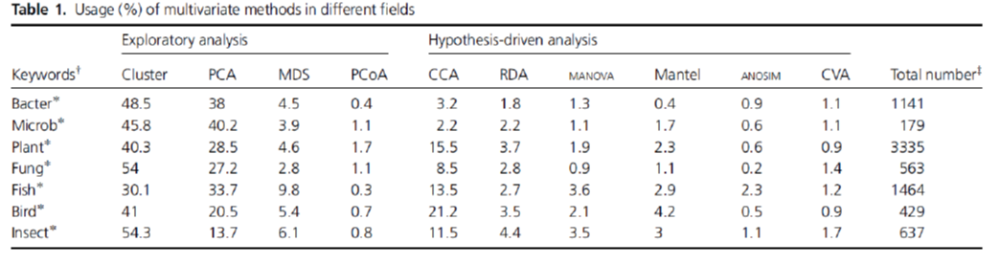

Five types of scientific inquiries usually suit to the application of multivariate methods.

+ **Sorting and grouping**: many ecological questions are concerned with the similarity or dissimilarity. *Ex:Cluster analysis, non Metric Dimensional Scaling (nMDS)*

+ **Data reduction or structural simplification**: summarize multiple variables through a comparatively smaller set of 'synthetic' variables. *Ex: Principal Component Analysis (PCA)*

+ **Hypothesis testing**: detect and test pattern in the data (be careful of data dredging) . *Ex: MANOVA, PERMANOVA, ANOSIM* </span>

+ **Investigation of the dependence among variables**: dependence among response variables, among explanatory variables, or among both. *Ex: Redundancy analysis and other constrained analysis* </span>

+ **Prediction**: once the dependence detected and characterized multivariate models may be constructed in a very similar as we did before with univariate models.

<center>
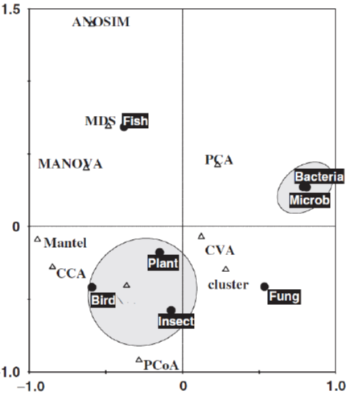{width=50%}
</center>


# Data Structure

In ecology, the'typical' dataset used in multivariate analyses will be represented by: 

+ objects in row (e.g. samples can be sites, time periods, etc.)

+ measured variables for those objects in columns (e.g. species, environmental parameters, etc.)

<center>

</center>
*Important note*: observations on object are not necessarily __independent__ on those made on another object, and a mixture of dependent and independent objects is possible e.g. site and year  


Measured variables can be binary, quantitative, qualitative, rank-ordered, or even a mixture of them. If variables do not have uniform scale (e.g. environmental parameters measured in different units or scales), they usually have to be transformed (see [here](https://sites.google.com/site/mb3gustame/reference/transformations) for more details about it) before performing further analyses.

 - **Standardization**: provides dimensionless variables and removes the influence of magnitude differences between scales and units

- **Normalization**: aims at correcting the distribution shapes of certain variables. 

  + `arcsin (x)` *family of transformations for percentage and  proportions*

  + `log (x + constant)` *for variables departing moderately from normal distribution*

  + `sqrt (x + constant) `*for variables departing slightly from normal distribution*

  + **Hellinger transformation** to make data containing many zeros suitable for PCA or RDA, the 'double zeros' problem. 

  + **Chord transformation** to give less weight to rare species (especially when rare species are not truly rare)

  + ...


The function `decostand` from the `vegan` package offers an easy way to transform your data. The `varespec` data frame has **24 rows** and **44 columns**. Columns are estimated cover values of **44 lichen species**. The variable names are formed from the scientific names, and are self explanatory for anybody familiar with vegetation type / lichen species. 


```{r,  eval=T}
# ?varespec
data (varespec)
varespec[1:5,1:5]
```


```{r,  eval=T, warning=F}
# log,  hellinger, and presence/absence transformations
varespec.log<-decostand(varespec,'log')
varespec.hell<-decostand(varespec,'hellinger')
varespec.pa<-decostand(varespec,'pa')
varespec.pa [1:5,1:5]
```

# Ressemblance

+ Most methods of multivariate analysis are **explicitly** or **implicitly** based on the comparison of all possible pairs of objects or descriptors.

+ Comparison takes the form of association measures which are assembled in a square and symmetrical association matrix of dimension $n$ x $n$ when objects are compared, or $p$ x $p$ when variables are compared. The choice of a suitable **association coefficient** is crucial for further analysis.

+ When pairs of objects are compared, the analysis is said to be in **Q mode**.When pairs of descriptors are compared, the analysis is said to be in **R mode**.

<center>
{width=50%}
</center>

## Q mode

Virtually, all distance or similarity measures used in ecology are symmetric: the coefficient between pairs of objects is the same! 

But how to deal with **double-zeros**?

- the **zero value** has the **same meaning** as any other values (*e.g. 0mg/L of O2 in deep anoxic layer of a lake*)

- the **zero value** in matrix of species abundances (or presence-absence) can **not** always be counted as an indication of **resemblance** (presence has an ecological meaning, but no conclusions on the absence: e.g. *is the absence of a given nationality in this class means that no students from this specific country are in NTU? And is it an element to evaluate the similarity with other university (high similarity because many nationalities probably absent ? No, but at same sample size 1/0 becomes informative*)

Because of the **double-zeros** problem, 2 classes of association measures exist based on how they deal with this issue". 

+ The **symmetrical coefficients** will consider the information from the double-zero (also called 'negative matched'). 

+ The **asymmetrical coefficients** will ignore the information send from the double-zero. 

When analyzing species data, it is often recommended to use asymmetrical coefficients unless you have reason to consider each double absence in the matrix (*e.g. controlled experiment with known community composition or ecologically homogeneous areas with disturbed zones*)

### Example of common dissimilarity metrics

#### Presence/absence-based metrics

**Jaccard Similarity (S~7~)** is used to find similarities between sets. Computation is very simple when caomparing two sets:

<center>
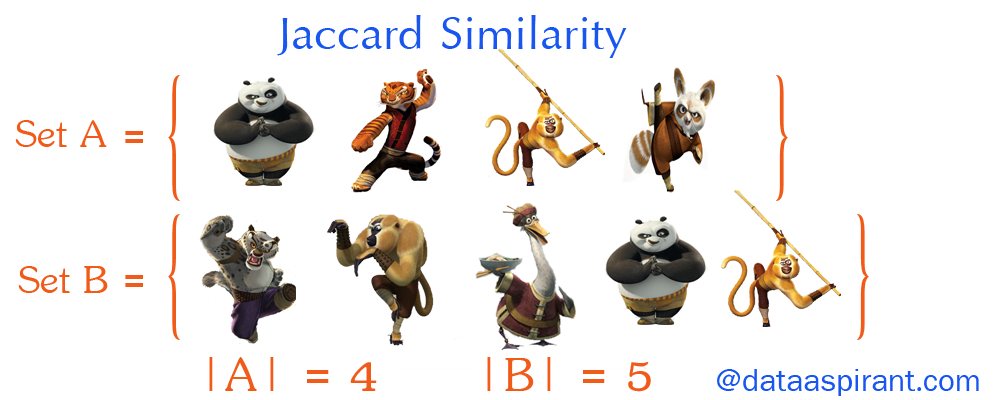{width=50%}
</center>

<center>
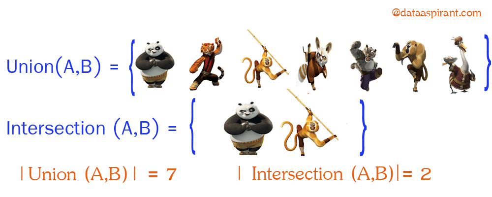{width=50%}
</center>

Now going back to Jaccard similarity.The Jaccard similarity measures similarity between finite sample sets, and is defined as the cardinality of the intersection of sets divided by the cardinality of the union of the sample sets. Suppose you want to find jaccard similarity between two sets A and B it is the ration of cardinality of A ∩ B and A ∪ B.

<center>
{width=50%}
</center>

This measure is very important when comparing $\beta$-diversity among sites.  Other distances applying to presence-Absence data: Sørensen (S~8~), Ochiai (S~14~) 


#### Abundance-based metrics

When your community data samples include abundance information (as opposed to simple presence-absence) you have a wider choice of metrics to use in calculating (dis)similarity. 

When you have abundance data your measures of (dis)similarity are a bit more “refined” and you have the potential to pick up patterns in the data that you would otherwise not see using presence-absence data.

There are many metrics that you might use to explore (dis)similarity. Four of them are particularly common:

+ Bray-Curtis
+ Canberra
+ Manhattan
+ Euclidean

You can get the spreadsheet [here](Data/Distance-metrics.xlsx) to examine how to compute them in details

**Euclidean distance (D~2~)** is the most commonly-used of our distance measures. For this reason, Euclidean distance is often just to referred to as “distance”. When data is dense or continuous, this is the best proximity measure. The Euclidean distance between two points is the length of the path connecting them.This distance between two points is given by the Pythagorean theorem.

<center>
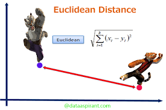{width=50%}
</center>


Here the abundance of a species from one sample is subtracted from its counterpart in the other sample. Instead of ignoring the sign, the result is squared (which gives a positive value):

$E_d=\sqrt{\sum (x_i-y_j)^2}$

**Manhattan distance** is a metric in which the distance between two points is the sum of the absolute differences of their Cartesian coordinates. In simple way of saying it is the absolute sum of difference between the x-coordinates and y-coordinates. Suppose we have a Point A and a Point B: if we want to find the Manhattan distance between them, we just have to sum up the absolute x-axis and y–axis variation. We find the Manhattan distance between two points by measuring along axes at right angles.

<center>
{width=50%}
</center>

This is the simplest dissimilarity metric to compute:

$CB_d = \sum|x_i-x_j|$


**Bray-Curtis (D~14~)** dissimilarity is the **golden** ditance metric in ecology.At first, you subtract the abundance of one species in a sample from its counterpart in the other sample but ignore the sign. The second component is the abundance of a species in one sample added to the abundance of its counterpart in the second sample. If a species is absent, then its abundance should be recorded as 0 (zero). 

$BC_d =  \frac {\sum |x_i-x_j|}{\sum(x_i+x_j)}$

<center>
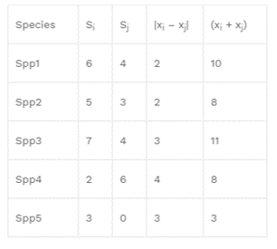{width=50%}
</center>

The **Canberra** dissimilarity uses the same components as Bray-Curtis but the components are summed differently:


$C_d =  \sum \frac { |x_i-x_j|}{(x_i+x_j)}$

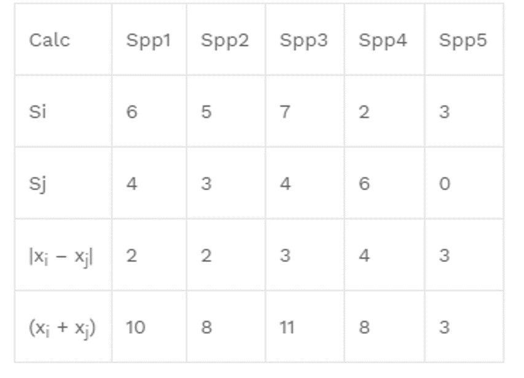{width=50%}

Many other 'distances' exist, each with their code

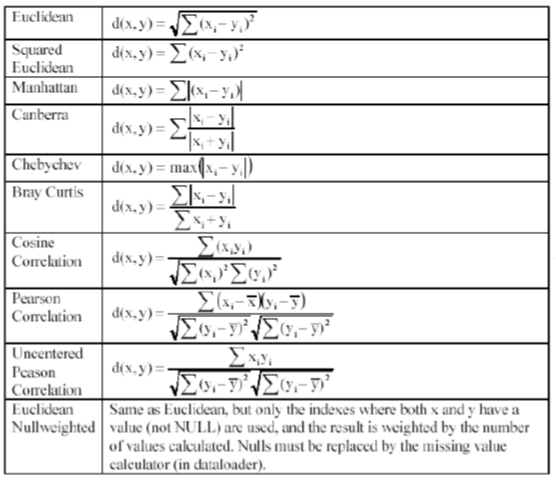{width=50%}

Those distance can be computed from an un-transformed or transformed matrix and for many used in ecology will deal with the double-zero problem.  

### Computation

The functions `vegdist` from the `vegan` package and `dist` from the `stats` package compute  dissimilarity indices useful and popular among community ecologists.

```{r,  eval=T}
# using varespec dataset
spe<-varespec

# quantitative data
# Bray-Curtis dissimilarity matrix on raw data
spe.db <- vegdist(spe)

# Bray-Curtis dissimilarity matrix on log-transformed data
spe.dbln <- vegdist(log1p(spe)) # log(x+1)

# Chord distance matrix
spe.norm<-decostand(spe,'nor')
spe.dc <- vegdist(spe.norm)

# Hellinger distance matrix
spe.hel<-decostand(spe,'hel')
spe.dh <- vegdist(spe.hel)

# using environmental dataset varechem,  clear interpretation of double zeros use Euclidean distance D1
data(varechem)
env <- varechem
env.st<-decostand(env,'stan') # standardized [or scale(env)]
env.de<-vegdist(env.st,method='euc') # then compute D1


# binary data
# Jaccard dissimilarity matrix using vegdist()
spe.dj1 <- vegdist(spe,'jac',binary=T)# binary p/a 

# Jaccard dissimilarity matrix using dist()
spe.dj2 <- dist(spe,'binary') 

# Sorensen dissimilarity matrix using vegdist()
spe.ds<-vegdist(spe,binary=T)

# Ochiai dissimilarity matrix using dist.binary() (ade4)
spe.och<-dist.binary(spe, method=7)
```

### Matrix visualization

Among many way to visualize similiarty matrix: the package `gclus`and the function `coldiss` (Borcard et al. 2011) offer nice  nice heat map options

```{r,  eval=T}
coldiss(spe.db,byrank=F,diag=T) # for the bc dissimilarity on raw data 
coldiss(spe.dbln,byrank=F,diag=T) # for the bc dissimilarity on log-transformed data
coldiss(env.de, diag=T) # for the environmental data
```

In the untransformed distance matrix, the small differences in abundant species have the same importance as small differences in species with few individuals.

Distance matrices can also be visualized through a network of similarities:

```{r,  eval=T}
qgraph(1-spe.db, layout='spring', vsize=4)
```


**Note 1**: In **Q mode** similarity from binary data can be interpret by a simple matching coefficient **S~1~**: for each pair of sites, it is the ratio between the number of double 1s plus double 0s and the total number of variables.
 

**Note 2**: For mixed types variables, including categorical or qualitative multiclass variables use **Gower's similarity (S~15~)**. It is easily computed in R using `daisy` function built in the `cluster` package. Avoid `vegdist` with `method='gower'`, which is appropriate for quantitative and presence-absence, but not for multiclass variables. Overall, `gowdis` from the package `FD` is the most complete function to compute Gower's coefficient in R, and commonly used in **trait-based approach** analyses. 


## R mode

Correlation type coefficents are commonly used to compare variable in R mode. Remember: 

+ Parametric (*Pearson coefficient*)

+ Non-parametric (*Spearman, Kendall for quantitative or semi-quantitative data*)

+ *Chi-square* statistic + its derived forms for qualitative variables

+ Binary coefficient such as *Jaccard*, *Sorensen*, and *Ochiai* for presence-absence data

+ ...

```{r,  eval=T}
spe.t <- t(spe)# transpose species matrix
spe.t.chi <- decostand(spe.t,'chi.square') # Chi-square transformation
spe.t.D16 <-dist(spe.t.chi)# euclidean distance
coldiss(spe.t.D16, diag=T) # visualization
qgraph(1-spe.t.D16, layout='spring', vsize=4)
```

In R mode, the use of *Pearson* coefficient is very common. Applied on binary variables, r *Pearson* is called the **point correlation coefficient**. Using the function `panelutils` (Borcard et al. (2011):


```{r,  eval=T}
#  Pearson r linear correlation among env. variable
env.pearson <- cor(env) # default method = 'pearson')
env.pearson <- round(env.pearson,2)
# re-order the variables prior to plotting
env.o<-order.single(env.pearson)
# need panelutils () on ceiba
pairs (env[,env.o], lower.panel=panel.smooth, upper.panel=panel.cor,diag.panel=panel.hist, main='Pearson Correlation Matrix')
```

<p class="comment">
**Practice 8.1** Using the `tikus` data set from the package `mvabund` - check `?tikus`. Select observation for the year  1981, 1983, and 1985 only (noted `81`, `83` and `85`). Build a  Bray-Curtis dissimilarity matrix among selected observations. Plot heat map of the respective matrix. Build a network of species co-occurrence (presence/absence) based on your selection of years.
</p>


# Trees

We often aim to recognize discontinuous **subsets** in an environment which is  represented by discrete (taxonomy) changes but  perceived as continuous changes in ecology.

**Clustering** consists in partitioning the collection of objects (or descriptors in R-mode). Clustering **does not test** any hypothesis.

**Clustering** is an explanatory procedure which helps to understand data with complex structure and multivariate relationships, and is a very useful method to extract knowledge and information especially from large datasets.

Many **clustering** approaches rely on association matrix, which stresses on the **importance** of the choice of an appropriate association coefficient.

## Families

1. **Sequential** or **Simultaneous** algorithms (most of the clustering algorithm)

2. **Agglomerative** or **Divisive**

3. **Monothetic** (cluster members with common prop.) versus **Polythetic** (distance between elements defines membership)

4. **Hierarchical** versus **Non-hierarchical** (flat)

5. **Probabilistic** (decision tree) versus **non-probabilistic** methods

6. **Hard** and **Soft** (may overlap)

Calculate numerical classification often requires two arguments: matrix of distances among samples (ecological resemblance, D) and the method to us *e.g.*: name of the clustering algorithm.

Common hierarchical clustering methods are available through the function `hclust` from the `stats` package. Be careful of:

+ **Data dredging** clustering produces tree-like structure. You don't choose clustering method according to how your tree looks like.

+ The suitable method is usually carefully **selected** and/or **evaluated** according to the data set you are dealing with and your initial hypotheses (some may not make sense)

## Hierarchical Clustering


* **Single linkage agglomerative clustering** (neighbor sorting)

Single linkage allows object to agglomerate easily to a group since a link to a single object of the group suffices to induce fusion. **This is the 'closest' friend' procedure**.

  + commonly produced chain dendrograms: a pair is linked to a third object
  
  + agglomerates objects on the basis of their shortest pairwise distance
  
  + partitions difficult to interpret, but gradients quite clear
  
*e.g. Single linkage agglomerative clustering computed on chord distance matrix*

```{r class.source = "fold-show", eval=T, warning=F}
# Step 1: chord distance = normalization + euclidean
spe.norm<-decostand(spe,'normalize') 
spe.ch<-vegdist(spe.norm,'euc') 
```

```{r class.source = "fold-show", eval=T, warning=F}
# Step 2: single linkage agglomerative clustering
spe.ch.single <-hclust(spe.ch,method='single') 
# plot function
plot(spe.ch.single, main='Single linkage agglomerative clustering' ) 
```

* **Complete linkage agglomerative clustering** (furthest neighbor sorting)

A group admits a new member only at the distance corresponding to the furthest object of the group: **one could say that the admission requires unanimity of the group**.

  + dendrograms look a bit like rakes – some cluster merge together at the highest dissimilarity

  + allow an object (or a group) to agglomerate with another group only at the distance corresponding to that of the most distant pair of objects 

*e.g. Complete linkage agglomerative clustering computed on chord distance matrix*

```{r class.source = "fold-show", eval=T, warning=F}
spe.ch.complete<-hclust(spe.ch,method='complete') 
plot(spe.ch.complete, main='Complete linkage agglomerative clustering') 
```

* **Average agglomerative clustering**

  + it is the method the **most common** in ecology (species data)

  + this family comprises **four methods** that are based on **average** dissimilarities among objects or on the **centroids** of cluster,
  
<center>
{width=75%}
</center>

*e.g. Average agglomerative clustering (UPGMA) computed on chord distance matrix*

```{r class.source = "fold-show", eval=T, warning=F}
spe.ch.UPGMA<-hclust(spe.ch,method='average') 
plot(spe.ch.UPGMA, main='Average (UPGMA) agglomerative clustering') 
```

* **Ward's Minimum Variance clustering**

    + **Ward** method is also a favorite  clustering method: Unlike the others. Instead of measuring the distance directly, it analyzes the variance of clusters. Ward’s is said to be the most suitable method for quantitative variables.
 
    + it is based on linear model criterion of least square: within-group sum of square is minimized.
 
**Note**: Ward method is based on Euclidean model. It should not be combined with distance measures, which are not strictly metric such as the popular Bray-Curtis distance.

```{r class.source = "fold-show", eval=T, warning=F}
spe.ch.ward<-hclust(spe.ch,method='ward.D') 
plot(spe.ch.ward, main='Ward clustering') 
```

### Clustering quality 

There are many ways to evaluate the overall quality of the chose clustering algorithms and therefore of their representations.

* the **cophenetic correlation** related distances extracted from the dendrogram (function `cophenetic` on a `hclust` object) with ditances in our original distance matrices. A higher correlation means a better representation of the initial matrix. 

```{r class.source = "fold-show", eval=T, warning=F}
# Single linkage clustering
spe.ch.single.coph <- cophenetic (spe.ch.single)
cor(spe.ch,spe.ch.single.coph)

# complete linkage clustering
spe.ch.complete.coph <- cophenetic (spe.ch.complete)
cor(spe.ch,spe.ch.complete.coph)

# Average clustering
spe.ch.UPGMA.coph <- cophenetic (spe.ch.UPGMA)
cor(spe.ch,spe.ch.UPGMA.coph)

# Ward clustering
spe.ch.ward.coph <- cophenetic (spe.ch.ward)
cor(spe.ch,spe.ch.ward.coph)
```

* the **shepard-like diagram** is a plot that represents orginal distances against the cophentic distances. Can be combined with cophentic correlation seen above. 


```{r class.source = "fold-show", eval=T, warning=F}
par(mfrow=c(2,2))

plot(spe.ch,spe.ch.single.coph,xlab='Chord distance',ylab='Chophenetic distance',asp=1, main=c('Single linkage',paste('Cophenetic correlation',round(cor(spe.ch,spe.ch.single.coph),3))))
abline (0,1)
lines(lowess(spe.ch,spe.ch.single.coph),col='red')

plot(spe.ch,spe.ch.complete.coph,xlab='Chord distance',ylab='Chophenetic distance',asp=1, main=c('Complete linkage',paste('Cophenetic correlation',round(cor(spe.ch, spe.ch.complete.coph),3))))
abline (0,1)
lines(lowess(spe.ch, spe.ch.complete.coph),col='red')

plot(spe.ch,spe.ch.UPGMA.coph,xlab='Chord distance',ylab='Chophenetic distance',asp=1, main=c('UPGMA',paste('Cophenetic correlation',round(cor(spe.ch,spe.ch.UPGMA.coph),3))))
abline (0,1)
lines(lowess(spe.ch,spe.ch.UPGMA.coph),col='red')

plot(spe.ch,spe.ch.ward.coph,xlab='Chord distance',ylab='Chophenetic distance',asp=1, main=c('Ward clustering',paste('Cophenetic correlation',round(cor(spe.ch,spe.ch.ward.coph),3))))
abline (0,1)
lines(lowess(spe.ch,spe.ch.ward.coph),col='red')

dev.off()
```

### Interpretable clustering groups 

* **Fusion Level values**

The plot of the **Fusion Level Values** is further used a diagnostic of interpretable cluster groups. It examines values where a fusion between two branches of a dendrogram occurs. Specifically, this graph is is useful whenever you want to define an interpretable cutting levels.

```{r class.source = "fold-show", eval=T, warning=F}
plot(spe.ch.UPGMA$height, nrow(spe):2, 
     type='S',main='Fusion levels - chord - UPGMA',
     ylab='k (number of clusters)', xlab='h (node height)', col='grey')
text (spe.ch.UPGMA$height,nrow(spe):2, nrow(spe):2, col='red', cex=0.8)
```

The graph of fusion level values shows clear jump after each fusion between 2 and 6 groups Let's cut our dendrogram at the corresponding distance Do the groups makes sense? Do you obtain groups containing a substantial number of sites?

```{r class.source = "fold-show", eval=T, warning=F}
plot(spe.ch.UPGMA)
rect.hclust(spe.ch.UPGMA, k=6) # number of group
rect.hclust(spe.ch.UPGMA, h=0.79) # with height
```


Let's repeat the same for all the clustering methods:

```{r class.source = "fold-show", eval=T, warning=F}

par(mfrow=c(2,2))
# fusion level - single linkage clustering
plot(spe.ch.single$height, 
     nrow(spe):2, type='S',main='Fusion levels - chord - single',
     ylab='k (number of clusters)', xlab='h (node height)', col='grey')
text (spe.ch.single$height,nrow(spe):2, nrow(spe):2, col='red', cex=0.8)

# fusion level - complete linkage clustering
plot(spe.ch.complete$height, 
     nrow(spe):2, type='S',main='Fusion levels - chord - complete',
     ylab='k (number of clusters)', xlab='h (node height)', col='grey')
text (spe.ch.complete$height,nrow(spe):2, nrow(spe):2, col='red', cex=0.8)

# fusion level - UPGMA clustering
plot(spe.ch.UPGMA$height, nrow(spe):2, 
     type='S',main='Fusion levels - chord - UPGMA',
     ylab='k (number of clusters)', xlab='h (node height)', col='grey')
text (spe.ch.UPGMA$height,nrow(spe):2, nrow(spe):2, col='red', cex=0.8)

# fusion level - the ward clustering
plot(spe.ch.ward$height, nrow(spe):2,
     type='S',main='Fusion levels - chord - Ward',
     ylab='k (number of clusters)', xlab='h (node height)', col='grey')
text (spe.ch.ward$height,nrow(spe):2, nrow(spe):2, col='red', cex=0.8)
```

All graphs look a but different: there is no single 'truth' among these solution and each may provide insight onto the data. However the Chord UPGMA received the best supported in both the cophenetic correlation and sheppard-like diagram. Therefore, fusion levels may have have a stronger support examined with this cluster approach.

One can compared classification by cutting tree `cutree` and comparing grouping using contingency tables:

```{r class.source = "fold-show", eval=T, warning=F}
k<-5 # Number of groups (conscensus) 
spe.ch.single.g <- cutree(spe.ch.single, k)
spe.ch.complete.g <- cutree(spe.ch.complete, k)
spe.ch.UPGMA.g <- cutree(spe.ch.UPGMA, k)
spe.ch.ward.g <- cutree(spe.ch.ward, k)

table(spe.ch.single.g,spe.ch.complete.g) # Single vs complete
```

If two classifications provided the same group contents, the contingency table would show only non zero frequency value in each row and each column. It is never the case here.

* The **Silhouette** widths indicator

  + The silhouette width is a measure of the **degree of membership of an
object to its cluster** based on the average distance between this object
and all objects of the cluster to which is belongs, compared to the same
measure for the next closest cluster.

  + Silhouette widths range from 1 to 1 and can be averaged over all objects of a partition

  + The greater the value is, the greater the better the object is clustered Negative values mean that the corresponding objects have probably placed in the wrong cluster (intra group variation inter group variation). 

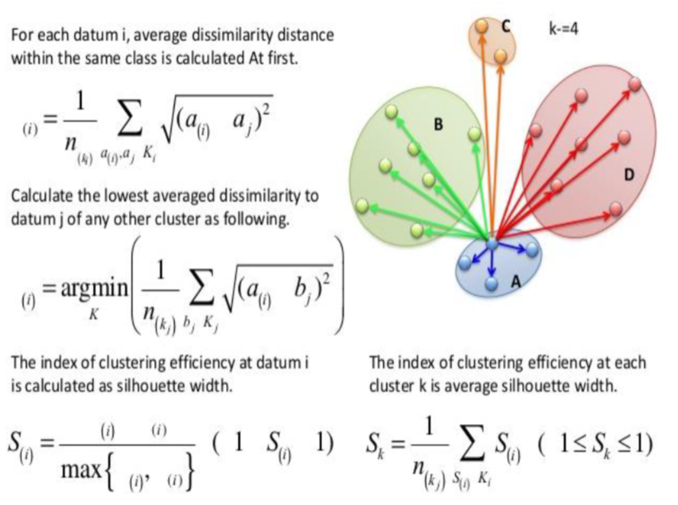

```{r class.source = "fold-show", eval=T, warning=F}
cutg<-cutree(spe.ch.UPGMA, k=3)
sil<-silhouette (cutg,spe.ch)
plot(sil)
```

* the **Elbow** method

  + This method looks at the percentage of variance explained (SS) as a function of the number of cluster

  + One should choose a number of clusters so that adding another cluster doesn't give much better explanation

At some point the marginal gain will drop, giving an angle in
the graph. The number of clusters is chosen at this point,
hence the "elbow criterion" (wss) .


```{r class.source = "fold-show", eval=T, warning=F}
fviz_nbclust(spe.norm, hcut, diss=dist(spe.norm, method='euclidean'),method = "wss",hc_method = "average")
#fviz_nbclust(spe.norm, hcut, diss=dist(spe.norm, method='euclidean'),method = "silhouette",hc_method = "average")
```

* The **Mantel** test

 + Compares the original distance matrix to (binary) matrices
computed from dendrogram cut at various level

  + Chooses the level where the matrix (correlation
between the two is the highest

  + The Mantel correlation is in its simplest sense, i.e. the
equivalent of a Pearson r correlation between the values in
the distance matrices

Comparison between the distance matrix and binary matrices representing partitions

```{r class.source = "fold-show", eval=T, warning=F}
## Mantel test
# Optimal number of clusters
# according to mantel statistic 
# Function to compute a binary distance matrix from groups
grpdist<-function(x){
  require (cluster)
  gr<-as.data.frame(as.factor(x))
  distgr<-daisy(gr,'gower')
  distgr
}
# run based on the UPGMA clustering
kt<-data.frame(k=1:nrow(spe),r=0)
for (i in 2:(nrow(spe)-1)){
  gr<-cutree(spe.ch.UPGMA,i)
  distgr<-grpdist(gr)
  mt<-cor(spe.ch,distgr, method='pearson')
  kt[i,2] <- mt
}
k.best <- which.max (kt$r)
plot(kt$k,kt$r, 
     type='h', main='Mantel-optimal number of clusters - UPGMA',
     xlab='k (number of groups)',ylab="Pearson's correlation")
axis(1,k.best, 
     paste('optimum', k.best, sep='\n'), col='red',font=2, col.axis='red')
points(k.best,max(kt$r),pch=16,col='red',cex=1.5)
```

* And many **others indicators**

See R packages `NbClust` for determining the relevant number of clusters in a data set.  

Charrad, M., Ghazzali, . N., Boiteau, V., & Niknafs, A. (2014). NbClust: An R Package for Determining the Relevant Number of Clusters in a Data Set. Journal of Statistical Software, 61(6), 1–36. https://doi.org/10.18637/jss.v061.i06

### Clustering options 

* Visualize groupings

```{r class.source = "fold-show", eval=T, warning=F}
plot(spe.ch.UPGMA, main='Average linkage')
rect.hclust(spe.ch.UPGMA, k=3)
rect.hclust(spe.ch.UPGMA, k=8, border = 'blue')
```

* Spatial clustering (example)

```{r class.source = "fold-show", eval=T, warning=F}
# note on the of Euclidean distance and Ward.D: SS based clustering 
# Bray + UPGMA can be try
# ?doubs
data(doubs)
doubs.spe<-doubs$fish
doubs.spa<-doubs$xy
# remove empty sample 8 from both datasets
doubs.spe <- doubs.spe[-8,]
doubs.spa <- doubs.spa[-8,]
# Calculates hierarchical cluster analysis of species data 
eucl.ward <- hclust (d = dist (doubs.spe), method = 'ward.D')
fviz_nbclust(doubs.spe, hcut, diss=dist(doubs.spe, method='euclidean'),method = "wss",hc_method = "single")
# Dendrogram with the observed groups
par(mfrow=c(1,2))
plot (eucl.ward)
rect.hclust (eucl.ward, k = 4, border = 1:4)
# Spatial distribution of samples with projection of hierarchical classification
eucl.ward.cluster <- cutree (eucl.ward, k = 4)
plot (y ~ x, data = doubs.spa, pch = eucl.ward.cluster, col = eucl.ward.cluster, type = 'b', main = 'Euclidean distance - Ward method')
dev.off()
```

* Heat map & clustering visualization (example)

We must reorder objects (function `reorder.hclust`) so that their order in the dissimilarity matrix is respected . This does not affect the topology of the dendrogram.

```{r class.source = "fold-show", eval=T, warning=F}
spe.chwo<-reorder.hclust(spe.ch.ward,spe.ch)
dend<-as.dendrogram(spe.chwo) 
heatmap(as.matrix(spe.ch),Rowv=dend,symm=TRUE, margin=c(3,3))
```


<p class="comment">
**Practice 8.2** Using `tikus` data set and subset on years 1981, 1983 and 1985: compute the three common clustering methods (single, complete, average) on a Bray-Curtis dissimilarities matrix. Compare resulting dendrograms using cophenetic correlation and Shepard-like diagram. Choose method with the one with the highest cophenetic correlation and produce a heat map of the reordered distance matrix together with a visualization of the related dendrogram. 
</p>


## Non-Hierarchical Clustering

(NOTE ON FUZZY - BRIEFLY EXPLAINED BELOW)

+ Create partition, without hierarchy.

+ Determine a partition of the objects into k groups, or clusters, such as the objects within each cluster are more similar to one other than to objects in the other clusters.

+ It require an initial configuration (user usually determine the number of groups, _k_), which will be optimized in a recursive process (often random). If random, the initial configuration is run a large number of times with different initial configurations in order to find the best solution.

The most known and commonly used non-hierarchical **partitioning algorithms** is **_k_-means clustering** (MacQueen, 1967), in which, each cluster is represented by the center or means of the data points belonging to the cluster.


Three  crital steps:

  + **Initialization** (various Methods: Lloyd's algorithm is the most common): _k_ observations from the dataset are used as the initial means. The **random partition** method first randomly assigns a cluster to each observation and then proceeds to the update step, thus computing the initial mean to be the centroid of the cluster's randomly assigned points. 

  + **Assignment step** Assign each observation to the cluster with the nearest mean: that with the least squared Euclidean distance (Mathematically, this means partitioning the observations according to the Voronoi diagram generated by the means) 
  
  + **Update step** Recalculate means (centroids) for observations assigned to each cluster.
  

The algorithm has **converged** when the assignments no longer change. The algorithm is not always guaranteed to find the optimum.

<center>
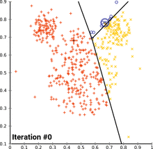{width=50%}
</center>


The algorithm is often presented as assigning objects to the nearest cluster by distance. Using a different distance function other than (squared) Euclidean distance may prevent the algorithm from converging. Various modifications of _k_-means such as **_k_-medoids** [**PAM (Partitioning Around Medoids**, Kaufman & Rousseeuw, 1990] have been proposed to allow using other distance measures. In this case, cluster is represented by one of the objects in the cluster.

*Note: if variable in the data table are not dimensionally homogenous, they must be standardized prior to partitioning*

Let's watch a video to undertand clearly what is K-means clustering:   https://www.youtube.com/watch?v=4b5d3muPQmA

If this is not clear, check [this video](https://www.youtube.com/watch?v=zHbxbb2ye3E) with an example with playing cards (very bad sound quality.

### K-means/PAM implementation

The aims is to identify **high-density regions** in the data. To do so, the method iteratively minimizes an objective function the **total error sum of squares (TESS or SSE)**, which is the sum of the within groups sums-of squares. *It is basically the sum, over the _k_ groups, of the sums of squared distance among the objects in the group, each divided by the number of objects in the group.*

<center>
{width=50%}
</center>

With a pre-determined number of groups, recommended function is: `kmeans` from the `stats` package. Argument `nstart` will repeat the analysis a large number of time using different initial configuration until finding the best solution.

*Note: do not forget to normalized your data*

```{r,  eval=T, message=F}
# k-means partitioning of the pre-transformed species data
spe.kmeans <- kmeans(spe.norm, centers=5, nstart=100)
# k-means group number of each observation spe.kmeans$cluster 
spe.kmeans$cluster
# Comparison with the 5-group classification derived from UPGMA clustering
comparison<-table(spe.kmeans$cluster,spe.ch.UPGMA.g)
comparison
# Visualize k-means clusters 
fviz_cluster(spe.kmeans, data = spe.norm,geom = "point",
             stand = FALSE, ellipse.type = "norm") 
```

### Best partition

**Evaluating** partition is made using similar indicators than above (note: some may only apply to hierarchical or non-hierarchical clustering). Next are elbow and silhouette indicators:

```{r,  eval=T, message=F}
# elbow, UPGMA, chord
fviz_nbclust(spe.norm, hcut, diss=dist(spe.norm, method='euclidean'),method = "wss",hc_method = "average")

# silhouette, UPGMA, chord
fviz_nbclust(spe.norm, hcut, diss=dist(spe.norm, method='euclidean'),method = "silhouette",hc_method = "average")

# elbow, kmeans, chord
fviz_nbclust(spe.norm, kmeans, method = "wss")

# silhouette, kmeans, chord
fviz_nbclust(spe.norm, kmeans, method = "silhouette")
```


The function `cascadeKM` in `vegan` package is a wrapper for the `kmeans` function

+ creates several partitions forming a cascade from small (argument `inf.gr` to large values of *k* (argument `sup.gr`)

+ the cascade proposes the 'best solution' for
partitioning using the `calinski` or `ssi` criterion

```{r,  eval=T, message=F}
spe.KM.cascade<-cascadeKM(spe.norm,inf.gr=2,sup.gr=10,iter=100,criterion='calinski')
plot(spe.KM.cascade,sortg=TRUE)
```

For `pam` clustering  (package `cluster`):

```{r,  eval=T, message=F}
fviz_nbclust (spe.norm , pam, method = "silhouette") 
fviz_nbclust (spe.norm , pam, method = "wss")
pamk(spe.norm, krange=2:10, criterion='asw')$nc
pam6<-pam(spe.norm, 6)
pam3<-pam(spe.norm, 3)
plot(silhouette(pam6))
plot(silhouette(pam3))
# plot1<-fviz_nbclust(spe.norm, hcut, method = "silhouette", hc_method = "average")
# plot2 < - fviz_nbclust (spe.norm , pam, method = "silhouette")
# plot3<-fviz_nbclust(spe.norm, kmeans, method = "silhouette")
# grid.arrange(plot1, plot2,plot3, ncol=3)
```

Visualize the partitions:

```{r,  eval=T, message=F}
pam.res<-pam(spe.norm, k=6)
km.res <- kmeans(spe.norm, centers=3)
plot4 <-fviz_cluster(km.res,spe.norm, stand = FALSE,geom = "point",ellipse.type = "norm") 
plot5 <-fviz_cluster(pam.res,spe.norm, stand = FALSE,geom = "point",ellipse.type = "norm")
grid.arrange(plot4, plot5, ncol=2)
```           


             
### **Fuzzy clustering**

The **fuzzy clustering** is considered as soft clustering or soft _k_-means, in which each element has a probability of belonging to each cluster. In other words, each element has a set of membership coefficients corresponding to the degree of being in a given cluster. In fuzzy clustering, points close to the center of a cluster, may be in the cluster to a higher degree than points in the edge of a cluster. The degree, to which an element belongs to a given cluster, is a numerical value varying from 0 to 1.


This is fundamnetally different from _k_-means and _k_-medoid clustering, where each object is affected exactly to one cluster. _k_-means and _k_-medoids clustering are known as hard or non-fuzzy clustering.

In other words, in non-fuzzy clustering an apple can be red or green (hard clustering). Here, the apple can be red AND green (soft clustering). The apple will be red to a certain degree [red = 0.5] as well as green to a certain degree [green = 0.5].

The **fuzzy c-means (FCM)** algorithm is one of the most widely used fuzzy clustering algorithms. The centroid of a cluster is calculated as the mean of all points, weighted by their degree of belonging to the cluster. The function `fanny` [`cluster` package] can be used to compute fuzzy clustering. 'FANNY' stands for *fuzzy analysis clustering*.

```{r,  eval=T, message=F}
set.seed(123)
res.fanny<-fanny(spe.norm, 3)
fviz_cluster(res.fanny, ellipse.type = "norm", repel = TRUE,
             palette = "jco", ggtheme = theme_minimal(),
             legend = "right")
res.fanny # details on membership
```

```{r,  eval=T, message=F}
fviz_silhouette(res.fanny, palette = "jco",
                ggtheme = theme_minimal())
```


Another example using the function `cmeans` from the package `e1071` and a dataset on the criminality in `USArrests` 


```{r,  eval=T, message=F}
set.seed(123)
# Load the data
data("USArrests")
# Subset of USArrests
ss <- sample(1:50, 20)
df <- scale(USArrests[ss,])
# Compute fuzzy clustering
cm <- cmeans(df, 4)
# Visualize using corrplot
corrplot(cm$membership, is.corr = FALSE)
```

using our Doubs dataset

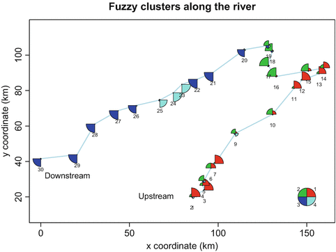


<p class="comment">
**Practice 8.3** Using `iris` data set: (1) make a K-means cascade and use the silhouette width indicator to determine the optimal number of clusters. (2)  since we know that 3 species are involved, group the data into 3 clusters (common sense) using the `kmeans` function. How many points are wrongly classified between optimal in (1) and the solution here? Plot both solutions.
</p>

```{r,  eval=T, message=F}
my_cols <- c("#00AFBB", "#E7B800", "#FC4E07")  
pairs(iris[,1:4], pch = 19,  cex = 0.5,
      col = my_cols[iris$Species],
      lower.panel=NULL)
```


```{r, code_folding = 'Show Solution',  eval=F}
fviz_nbclust(iris[, 1:4], kmeans, method = "silhouette")
spe.KM.cascade<-cascadeKM(iris[,1:4],inf.gr=2, sup.gr=10, iter=100, criterion='calinski')
plot(spe.KM.cascade,sortg=TRUE)

set.seed(1)
irisCluster<-kmeans(iris[, 1:4], 3, nstart= 20)
table(irisCluster$cluster, iris$Species)
irisCluster$cluster<-as.factor(irisCluster$cluster)
plot7<-ggplot(iris, aes(Petal.Length, Petal.Width, color = irisCluster$cluster + geom_point()
plot8<-ggplot(iris, aes(Petal.Length, Petal.Width, color = Species)) + geom_point()
grid.arrange(plot7, plot8, ncol=2)
```


## Decision trees

[Here](https://www.youtube.com/watch?v=7VeUPuFGJHk&ab_channel=StatQuestwithJoshStarmer) for a basic understanding of decision trees: 

### Classification And Regression Trees (CART)

The functions `tree` and `ctree` builds decision trees ([recursive partitioning algorithm](https://cran.r-project.org/web/packages/partykit/vignettes/ctree.pdf)). The first parameter is a formula, which defines a target variable and a list of independent variables.

```{r class.source = "fold-show",  eval=T}
tree1<-tree(Species~Sepal.Length + Sepal.Width + Petal.Length + Petal.Width, data=iris)
summary(tree1 )
plot(tree1)
text(tree1)
```


Another fancier option with the package `rpart`:

```{r class.source = "fold-show",  eval=T}
tree2 <- rpart(Species ~ ., data=iris, method="class")
fancyRpartPlot(tree2, main="Iris")
```

One of the disadvantages of decision trees may be **overfitting** i.e. continually creating partitions to achieve a relatively homogeneous population. This problem can be alleviated by **pruning** the tree (CART), which is basically removing the decisions from the bottom to up. Another way is to **combine several trees** and obtain a consensus, which can be done via a process called **random forests** (bootstrapped version of CART - many trees built based on subsets of the data, in addition not all predictor variables are used every time, rather a random subset). [HOME]

```{r class.source = "fold-show",  eval=T}
# Extra to exciting your curiosity
iris.rf=randomForest(Species~., data=iris, importance=TRUE, proximity=TRUE, ntree=500)
# Required number of trees gives errors for each species and the average for all species (black):
plot(iris.rf,lty=2)
# Misclassification error rates:
iris.rf$confusion
# Importance of individual predictor variables for classification (the further the value is on the right of the plot, the more important):
varImpPlot(iris.rf)
# The membership of a particular class as a function of a variable value can be displayed with this
partialPlot(iris.rf,iris,Petal.Width,"setosa")
# we can predict unclassified observations. We make up some sample new observations from the original dataset to save some time importing (the first three rows are P. setosa, lets see if RandomForest gets that right:
newobs=iris[1:3,1:4]
predict(iris.rf,newobs)
# This last plot conveys the confidence in your predictions for each individual sample. Colors represent species and points are samples. In this case, many samples can be predicted with great certainty (1) and only few classifications are questionable (approaching 0)
plot(margin(iris.rf))
```

### Multivariate Regression Trees: constrained clustering [HOME]

**Multivariate regression trees** (MRT; De’ath 2002) are an extension of univariate regression trees, a method allowing the recursive partitioning of a quantitative response variable under the control of a set of quantitative or categorical explanatory variables (Breiman et al. 1984). Such a procedure is sometimes called **constrained** or **supervised** clustering.The result is a tree whose “leaves” (terminal groups of sites) are composed of subsets of 'sites' chosen to minimize the within-group sums of squares (as in a _k_-means clustering), but where each successive partition is defined by a threshold value or a state of one of the explanatory variables.


The only package implementing a complete and handy version of MRT is `mvpart`. Unfortunately, this package is no longer supported by the R Core Team, so that no updates are available for R versions posterior to R 3.0.3. Nevertheless, `mvpart` can still be installed via github.


```{r class.source = "fold-show",  eval=T}
data(doubs)
spe.norm<-decostand(doubs$fish[-8,], 'nor')
env<-doubs$env[-8,]

# par(mfrow=c(1,2))
spe.ch.mvpart <-
  mvpart(data.matrix(spe.norm)~.,
         env,
         margin = 0.08,
         cp=0,
         xv='min', # try 'pick' best number, '1se'
         xval=nrow(spe),
         xvmult = 100
         )
```


### Hello World to Machine Learning [HOME]


Create a **Validation Dataset** We will split `iris` dataset into two, 80% of which we will use to train our models and 20% that we will hold back as a validation dataset. 

```{r class.source = "fold-show",  eval=T}
# create a list of 80% of the rows in the original dataset that we can use for training
validation_index <- createDataPartition(iris$Species, p=0.80, list=FALSE)
# select 20% of the data for validation
validation <- iris[-validation_index,]
# use the remaining 80% of data to training and testing the models
idataset <- iris[validation_index,]
```

You now have training data in the dataset variable and a validation set we will use later in the validation variable.

**Evaluate Algorithm** it is time to create some models of the data and estimate their accuracy on unseen data. 

 + Step 1: set-up the test harness to use 10-fold cross validation.
 We will 10-fold crossvalidation to estimate accuracy.This will split our dataset into 10 parts, train in 9 and test on 1 and release for all combinations of train-test splits. We will also repeat the process 3 times for each algorithm with different splits of the data into 10 groups, in an effort to get a more accurate estimate

```{r class.source = "fold-show",  eval=T}
# Run algorithms using 10-fold cross validation
control <- trainControl(method="cv", number=10)
metric <- "Accuracy"
```

We are using the metric of “Accuracy” to evaluate models. This is a ratio of the number of correctly predicted instances in divided by the total number of instances in the dataset multiplied by 100 to give a percentage (e.g. [XX]% accurate). We will be using the metric variable when we run build and evaluate each model next.

  + Step 2: Build Models. We don’t know which algorithms would be good on this problem or what configurations to use, let's evaluate 3 different algorithms:

    * Classification and Regression Trees (CART) - non linear algorithm
    * k-Nearest Neighbors (kNN)  - non linear algorithm
    * Linear Discriminant Analysis (LDA) - linear algorithm
    * Random Forest (RF)  - advanced algorithms

```{r class.source = "fold-show", eval=T, cache=T}
# lda
set.seed(10)
fit.lda <- train(Species~., data=idataset, method="lda", metric=metric, trControl=control)
# CART
set.seed(10)
fit.cart <- train(Species~., data=idataset, method="rpart", metric=metric, trControl=control)
# kNN
set.seed(10)
fit.knn <- train(Species~., data=idataset, method="knn", metric=metric, trControl=control)
# Random Forest
set.seed(10)
fit.rf <- train(Species~., data=idataset, method="rf", metric=metric, trControl=control)
```

 + Step 3: Build Models. We don’t know which algorithms would be good on this problem or what configurations to use, let's evaluate 3 different algorithms:

We now have 4 models and accuracy estimations for each. We need to compare the models to each other and select the most accurate.

We can report on the accuracy of each model by first creating a list of the created models and using the summary function.

```{r class.source = "fold-show",  eval=T}
# summarize accuracy of models
results <- resamples(list(lda=fit.lda, cart=fit.cart, knn=fit.knn, rf=fit.rf))
summary(results)$statistics$Accuracy
```

We can see that the most accurate model in this case was LDA:


```{r class.source = "fold-show",  eval=T}
# summarize Best Model
print(fit.lda)
```

This gives a nice summary of what was used to train the model and the mean and standard deviation (SD) accuracy achieved, specifically XX.X% accuracy +/- X%


**Prediction**

The LDA was the most accurate model. Now we want to get an idea of the accuracy of the model on our validation set.

This will give us an independent final check on the accuracy of the best model. It is valuable to keep a validation set just in case you made a slip during such as overfitting to the training set or a data leak. Both will result in an overly optimistic result.

We can run the LDA model directly on the validation set and summarize the results in a confusion matrix.

```{r, class.source = "fold-show", eval=T}
# estimate skill of LDA on the validation dataset
predictions <- predict(fit.lda, validation)
confusionMatrix(predictions, validation$Species)
```

We can see that the accuracy is XXX%. It was a small validation dataset (20%), but this result is within our expected margin of XX% +/-X% (Accuracy +/- SD of lda model) suggesting we may have an accurate and a reliably accurate model.

*See more* https://machinelearningmastery.com/machine-learning-in-r-step-by-step/


Basically, we learn about one **neurone** of a network. You are only one step toward Deep Learning.   


# Ordinations

## Background

[GUSTA ME](https://sites.google.com/site/mb3gustame/home?overridemobile=true) provides a guide to statistical analysis (community-focused) in Microbial Ecology. Very useful to help in the choice of the relevant analysis according to the type of data you are dealing with.

### Multidimensional space

The aim of ordination methods is to represent the data along a reduced number of orthogonal axes, constructed in such way that they represent, in decreasing order, the **main trends of the data**

 + The renders can be **interpreted visually or in association with other methods** such as clustering or regression

 + Most ordination methods (except nMDS) are based on the extraction of the **eigenvectors** of an association matrix

### Families

Two big families of ordination analyses exist according to how they are dealing with  environmental matrix (if any):

+ **unconstrained ordination** (indirect gradient analysis, ordination not constrained by environmental factors).They are descriptive methodologies and describe patterns. It generates hypotheses but cannot test them.

    * uncover main compositional gradients in the species data, 	structuring the community, and these gradients can be 	interpreted by known (estimated or measured) 	environmental factors
    
    * environmental variables can be used a posteriori, after the analysis
    
+ **constrained ordination** (direct gradient analysis, ordination axes are constrained by environmental factors). It tests directly  hypotheses about the influence of environmental factors on species composition*

    * relates the **species composition directly to the 	environmental variables** and extracts the variance in species 	composition which is directly related to these variable*

    * regarding environmental factors, it offers several interesting options such as **step-wise selection** of important environmental 	variables (and excluding those which are not relevant for species composition), test of **significance of the variance 	explained by environmental factors**	and **partitioning variance explained by particular environmental variables**

### Types

In addition, based on data input, two types of ordination analyses exist. 

  + **raw data**: based on analysis of raw sample-species matrices with abundance or presence/absence data. Two categories recognized, differing by assumption of species response along environmental gradient:
  
    + **linear**, species response linearly along env. gradient, which could be true for rather homogenous ecological data, where ecological gradients are not too long. **Short gradient**.

    + **unimodal**, species response unimodally along gradient, having its optima at certain gradient position. More close to reality of ecological data, more suitable for heterogenous dataset (long gradients + many zeros and turnover). **Long gradient**.
    
  


+ **distances**: distance matrix  computed by similarity/dissimilarity measures, and projecting these distances into two or more dimensional diagrams</span>

### Framework 

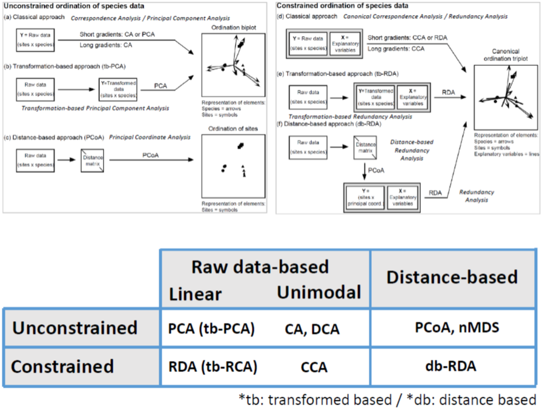

The selection toward linear or unimodal ordination appraoch is commonly determined by a rule of thumb by performing a Detrended Correspondance Analysis (DCA) `decorana` on the dataset, then to check the length of the 1st DCA axis. Typically, it says: 

+ **length>4**, data are heterogenous and you should use unimodal methods

+ **length<3**, data are homogenous and you should use linear methods

There is a **grey zone** between **3 and 4** where both methods are okay - in addition if your data are heterogenous, you still can use PCA/RDA using Hellinger's transformation of species data* (tbPCA)

```{r,  eval=T, message=F}
data(varespec)
decorana(varespec)
data(doubs)
doubspec<-doubs$fish[-8,]
decorana(doubspec)
```

## Unconstrained ordination

+ **Principal Component Analysis (PCA)**: the main eigenvector-based method (and the most famous). Works on raw, quantitative data. Preserve the **Euclidean** distance among sites. 

+ **Correspondance Analysis (CA)**: works on data that must be frequency or frequency-like, dimensionnally homogenous, and non-negative. Preserve the **Chi-square** distance among rows and columns. Applied in ecology to analyze species data.

+ **Principal Coordinate Analysis (PCoA, also called MDS)**: devoted to the ordination of distance matrix, most often in Q mode. Great flexibility in the choice of association measures. Common in trait-based approach because of it.

+ **non-metric Multi-Dimensional Scaling (nMDS)** unlike the three others, this is not an eigenvector-based method. nMDS tries to represent the set of objects along a predetrmined number of axes (usually 2) while preserving the ordering relationship among them.

### Principal Component Analysis (PCA)

A PCA carries out a **rotation system of axes** defined by the variables, such as new axes (called principal component) are orthogonal to one another, and correspond to the successive dimensions of maximum variance of the scatter plot.

A PCA will find the "best" line (first principal component) according to two different criteria of what is the "best": maximize the variance & minimize the error.

Applied to a 2D example on wine testing, this is like to identify a new property of wine by a combination of two variables (alcohol content and wine darkness) by drwaing a line through the center of the wine cloud. 


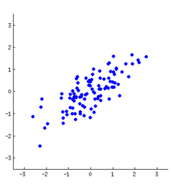


It corresponds to a simple application of the Pythagora theorem


The direction is given by eigenvector, and the strength by the eigenvalues. 

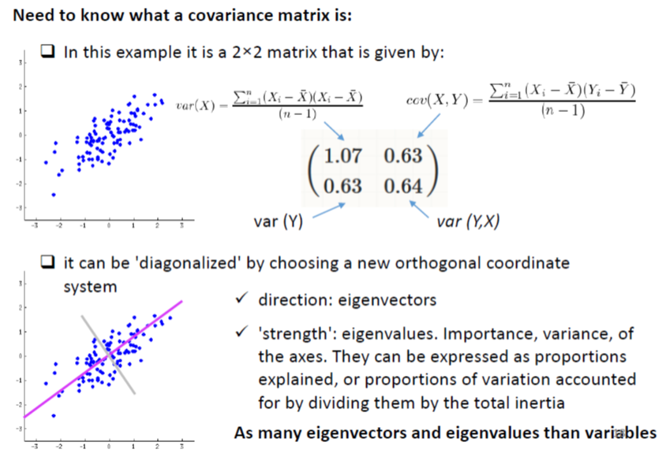

Check it  [here](http://setosa.io/ev/principal-component-analysis/) for a very simple explanation of how PCA works, and [here](https://www.youtube.com/watch?v=S51bTyIwxFs) for a
a more detailed example. By the way *TileStats* channel is very good if you are looking at some simple explanation about statistics. It complements very well *StatQuest* explanation on [PCA](https://www.youtube.com/watch?v=FgakZw6K1QQ) for 


#### PCA in R

##### Computation

In R, a **PCA** can be computed with the function `rda` from the `vegan`among many other options.

```{r,  eval=T, message=F}
# PCA on on the full data varechem dataset
# arg scale =T, standardize our variables within the rda function
data(varechem)
env<-varechem
env.pca<-rda(env, scale=T) 
env.pca
summary(env.pca) # default scaling 2
```


**Inertia**: in `vegan`’s language, this is the general term for “variation” in the data

**Constrained and unconstrained**: In PCA, the analysis is unconstrained, i.e. not constrained by a set of explanatory variables, and so are the results

**Eigenvalues**, symbolized λj: these are measures of the importance (variance) of the PCA axes. They can be expressed as Proportions Explained, or proportions of variation accounted for by the axes, by dividing each eigenvalue by the “total inertia”.

**Scaling**: not to be confused with the argument “scale” calling for standardization of variables. “Scaling” refers to the way ordination results are projected in the reduced space for graphical display. There is no single way of optimally displaying objects and variables together in a PCA biplot, i.e., a plot showing two types of results, here the sites and the variables. Two main types of scaling are generally used. Each of them has properties that must be kept in mind for proper interpretation of the biplots. Here we give the essential features of each scaling. Please refer to Legendre and Legendre (2012) for a complete desciption.

+ **Scaling 1** = distance biplot: the eigenvectors are scaled to unit length. (1) **Distances among objects in the biplot are approximations of their Euclidean distances in multidimensional space**. (2) The angles among descriptor vectors do not reflect their correlations.

+ **Scaling 2** = correlation biplot: each eigenvector is scaled to the square root of its eigenvalue. (1) Distances among objects in the biplot are not approximations of their Euclidean distances in multidimensional space. (2) **The angles between descriptors in the biplot reflect their correlations.**

+ The compromise **Scaling 3** has no clear interpretation rules, and
therefore we will not discuss it further.

Bottom line: if the main interest of the analysis is to interpret the relationships among **objects**, choose **scaling 1**. If the main interest focuses on the relationships among descriptors, choose **scaling 2**.

```{r,  eval=T, message=F}
# Plots using biplot
# To help memorize the meaning of the scalings, vegan now accepts argument scaling = "sites" for scaling 1 and scaling="species" for scaling 2. This is true for all vegan functions involving scalings
par(mfrow = c(1, 2))
biplot(env.pca, scaling = 1, main = "PCA - scaling 1")
biplot(env.pca, main = "PCA - scaling 2") # Default scaling 2

# Plots using cleanplot.pca
cleanplot.pca(env.pca)
dev.off()
```

**Species scores**: coordinates of the arrowheads of the variables. For historical reasons, response variables are always called “species” in vegan, no matter what they represent, because `vegan` is built for vegetation analysis.

```{r,  eval=T, message=F}
summary(env.pca)$species
```

**Site scores**: coordinates of the sites in the ordination diagram. Objects are always called “Sites” in vegan output files.

```{r,  eval=T, message=F}
summary(env.pca)$site
```

##### Eigenvalues

Examine eigenvalues is important to decide how many axes to retain. Usually, the user examines the eigenvalues, and decides how many axes are worth representing and displaying on the basis of the amount of variance explained. The decision can be completely arbitrary (for
instance, interpret the number of axes necessary to represent 75% of the variance of the data), or assisted by one of several procedures proposed to set a limit between the axes that represent interesting variation of the data and axes that merely display the remaining, essentially random variance. 


One of these procedures consists in computing a **broken stick model**, which randomly divides a stick of unit length into One of these procedures consists in computing a broken stick model, which randomly divides a stick of unit length into the same number of pieces as there are PCA eigenvalues. One interprets only the axes whose eigenvalues are larger than the length of the corresponding piece of the stick, or, alternately, one may compare the sum of eigenvalues, from 1 to k, to the sum of the values from 1 to k predicted by the broken stick model.

```{r,  eval=T, message=F}
screeplot(env.pca, bstick = TRUE, npcs = length(env.pca$CA$eig))
```

##### Intepretation

The proportion of variance accounted for by the two axes is about 60 %: relative high value makes us confident that our interpretation of the first pair of axes extracts most relevant information from the data


```{r,  eval=T, message=F}
par(mfrow = c(1, 2))
cleanplot.pca(env.pca)
dev.off()
```

**Scaling 1**: Gradient from left to right with a group of sites displaying higher values of Ca, Mg, K, Zn, S. Gradient from top to down  with humpdepth and baresoil.

**Scaling 2**: Humdepth, Baresoil are very highly positively correlated. Those two variables are very highly negatively correlated with pH and Fe.


##### Adding cluster

```{r,  eval=T, message=F}
# combining clustering and ordination results
biplot(env.pca, main='PCA - scaling 1',scaling=1) 
ordicluster(env.pca, 
            hclust(dist(scale(env)), 'ward.D'), 
            prune=3, col = "blue", scaling=1)
```

##### PCA on transformed species data (tb-PCA)

PCA being a linear method preserving the Euclidean distance among sites, it is not naturally adapted to the analysis of species abundance data. Hellinger transformation of the data can solve this problem. 

```{r,  eval=T, message=F}
# Hellinger pre-transformation of the species data
data(varespec)
spe<-varespec
spe.h<-decostand(spe,'hellinger')

# DCA + RDA
decorana (spe.h)
spe.h.pca<-rda(spe.h)
screeplot(spe.h.pca,bstick = TRUE, npcs = length(spe.h.pca$CA$eig))

# plot PCA
cleanplot.pca (spe.h.pca)
```

**Note**: It is possible to get a passive (*post hoc*) explanation of axes using environmental variables. Although there are means of incorporating explanatory variables directly in the ordination process (canonical ordination), one may be interested in interpreting a simple ordination by means of external variables.

```{r,  eval=T, message=F}
#A posteriori projection of environmental variables in a PCA
# A PCA scaling 2 plot is produced in a new graphic window.
biplot(spe.h.pca, main = "PCA - scaling 2")
# Scaling 2 is default
(spe.h.pca.env <- envfit(spe.h.pca, env, scaling = 2))
# Plot significant variables with a user -selected colour
plot(spe.h.pca.env, p.max = 0.05, col = 3)
# This has added the significant environmental variables to the
# last biplot drawn by R.
# BEWARE: envfit() must be given the same scaling as the plot to 
# which its result is added!
```

`envfit`  proposes permutation tests to assess the significance of the R^2^ of each explanatory variable regressed on the two axes of the biplot. But this is not, by far, the best way to test the effect of explanatory variables on a table of response variables.

##### More on PCA

Conditions of applications:

+ PCA must be computed on **dimensionally homogenous** variables

+ data matrix **not transposed** since covariance or correlations among objects are meaningless

+ PCA can be applied to **binary** data

+ Species Presence-Absence data can be subject to a **Hellinger or chord transformation** prior PCA 

+ Interpretation relationship variable based on **angles**


<p class="comment">
**Practice 8.4** Using environmental dataset `carp.chemistry` from Carpathian wetland (mainly chemistry): (1)  remove the variable slope, which is not a chemical variable; (2) perform a PCA, and evaluate importance of ordination axes using the broken stick criterion; (3) make a biplots using scaling=1 and scaling 2 then interpret results; (4)  repeat the same for the species data associates. 
</p>


```{r,  eval=T, message=F}
carp.chemistry<-read.table ('https://www.dipintothereef.com/uploads/3/7/3/5/37359245/carp.chemistry.txt',header=T, sep=",",row.names=1)
carp.spec<-read.table ('https://www.dipintothereef.com/uploads/3/7/3/5/37359245/carp.vasc_plants.txt',header=T, sep=",",row.names=1)
```


```{r, code_folding = 'Show Solution',  eval=F}
#environmental data and RDA
chem$slope<-NULL
stand.chem <- scale (chem)
PCA1 <- rda (stand.chem) 

# broken stick
screeplot(PCA1,bstick = TRUE, npcs = length(PCA1$CA$eig))

# Keiser-Guttman Criteron (above average eigen value)
ev<-PCA1$CA$eig
barplot(ev, main='Eigenvalues',col='bisque',las=2)
abline(h=mean(ev),col='red') # average eigenvalue
legend('topright','Average eigenvalue',lwd=1,col=2,bty='n')

#biplot
clean.plot (PCA1)
```


### Correspondance Analysis (CA) - For reference only

+ Data submitted to CA must be **frequencies or frequency-like, dimensionally homogeneous and non-negative**; that is the case of species counts or presence-absence data. 

+ Accordingly, for a long time, **CA has been one of the favorite tools for the analysis of species presence-absence or abundance data** 

+ The raw data are first transformed into a matrix Q of cell-by-cell contributions to the **Pearson Chi-square statistic**, and the resulting table is submitted to a singular value decomposition to compute its  eigenvalues and eigenvectors

+ The result is an ordination, where it is the **Chi-square distance (D16)** that is **preserved** among sites **instead of the Euclidean distance D1**.

+ **Chi-square distance is not influenced by the double zeros**. Therefore, CA is a method adapted to the analysis of species abundance data without pre-transformation. 

#### Graphical representation

Accordingly, in a CA, both objects and species are represented by points in the ordination diagram (compared to PCA where species/descriptors are vectors and sites are points). 

***Note 1**: Chi-square gives high weight to rare species, so usually considered as one the least suitable distance measures for ecological data.*

***Note 2**: Suffers from an artefact called **arch effect**, which is caused by non-linear correlation between the first and higher axes. Popular, even though clumsy way how to remove this artefact is to use **Detrending Correspondance Analysis (DCA)***


Similarly to PCA, two type of scaling are possible: 

+ **scaling 1**: the distances **among objects (sites)** in the reduced ordination space approximate their chi-square distance; any object found near the point representing a species is likely to contain a high contribution of that species.

+ **scaling 2**: the distances **among descriptors (species)** in the reduced space approximate their chi-square distances; any species that lies close to the point representing an object is more likely to be found in that object or to have higher frequency there. 
 
Both  The **broken stick model** and **Kaiser-Guttman criterion** applied for guidance on CA axes to retain.
 
#### Computation

Correspondance analysis can be computed using the function `cca` (library `vegan`). If the environmental matrix is not specified, `cca` calculates an unconstrained correspondence analysis. 

You can apply the functions `screeplot` or `evplot` (Borcard et al. 2011), in order to select important ordination axes based on Kaiser-Guttman or broken stick model.

```{r class.source = "fold-show",  eval=T, message=F}
spe.ca<-cca(spe) #default summary for "scaling = 2" 
screeplot(spe.ca, bstick = TRUE, npcs = length(spe.ca$CA$eig))
ev2<-spe.ca$CA$eig # extract eigen value
evplot(ev2)
```

It is time to draw the CA biplots of this analysis. Let us compare the two scalings.

```{r,  eval=T, message=F}
# CA biplots
par(mfrow=c(1,2))
# Scaling 1: sites are centroids of species
plot(spe.ca,scaling=1,main='CA - biplot scaling 1')
# Scaling 2: species are centroids of species
plot(spe.ca,main='CA - biplot scaling 2')
```

Another option using function `ordplot`

```{r,  eval=T, message=F}
# CA biplots
par(mfrow=c(1,2))
# Scaling 1: sites are centroids of species
ordiplot(spe.ca,scaling=1,main='CA - biplot scaling 1')
# Scaling 2: species are centroids of species
ordiplot(spe.ca,main='CA - biplot scaling 2')
dev.off()
```

#### Passive (Post Hoc) explanation of axes using environmental parameters

Here again you can use `envfit` from the `vegan` package: finds vectors or factors average of environmental variables. The projections of points onto vectors have maximum correlation with corresponding environmental variables, and the factors show the averages of factor levels.


```{r,  eval=T, message=F}
# A posteriori projection of environmental variables in a CA
# The last plot produced (CA scaling 2) must be active
plot(spe.ca,main='CA- biplot scaling 2')
spe.ca.env <-envfit(spe.ca,env)
plot(spe.ca.env)
# It added the environment variables to the last biplot drawn
```

```{r,  eval=T, message=F}
plot(spe.ca, main = "CA - scaling 2",
sub = "Fitted curves: humdepth (red), Baresoil (green)")
spe.ca.env <- envfit(spe.ca ~ Humdepth + Baresoil, env)
plot(spe.ca.env) # Two arrows
ordisurf(spe.ca, env$Humdepth, add = TRUE)
ordisurf(spe.ca, env$Baresoil, add = TRUE, col = "green")
```

#### Arch effect and Detrended Correspondance Analysis (DCA)

Long environmental gradients often support a succession of species. Since the species that are controlled by environmental factors tend to have unimodal distribution, a long gradient may encompass sites that, at both ends of the gradient, have no species in common: their distance reaches a maximum value (or their similarity is 0). But if we look at either side of the succession, contiguous sites continue to grow more different from each other. Therefore, instead of linear trend on PCA, the gradient is represented on the pair of CA axes as an arch. 

**Detrending is the process of removing the arch effect**: DCA does it by dividing the first axis into segments  (or polynomial relationship), and then by centering the second axis on zero. Watch [here](https://www.youtube.com/watch?v=OHMf42Sy6KM) 

**Detrended Correspondance Analysis (DCA)** is often criticized and not recommended. Howver, DCA is still one of the most widely used unconstrained ordination methods among vegetation ecologist (zoologist are biased toward nMDS). 

```{r,  eval=T, message=F}
doubs.dca<-decorana(doubspec)
plot(doubs.dca)
```

<p class="comment">
**Practice 8.5** Using Ellenberg's Danube meadow dataset, data `mveg` from the package `dave`: (1) Compare the results of CA and DCA; (2) Try (more challenging) to combine the results of both  CA and DCA in the same ordination plot. (Tip 1) You may need functions `cca`, `decorana`, `ordiplot`, `scores` and `text`. (Tip 2) First calculate both CA and DCA on Danube data and draw CA ordination scatterplot (to draw only sites, in ordiplot use argument `display = 'sites'`). (Tip 3) To add sites from DCA, you need to shift their scores along the second (vertical) axis, otherwise they will be clustered together with CA samples. Add constant (e.g. 2) to the scores along the second axis. To extract scores, use the function scores on object DCA with argument `display = 'sites'` ) (Tip 4) To add sites from DCA into CA ordination plot, use low-level graphical function text on matrix of scores from DCA, with corrected second axis.(Tip 5). To avoid overlap of labels in text function, employ also the argument labels, which should contain values from rownames of DCA scores.  Results should look similar to this:
</p>


### Principal Coordinate Analysis (PCoA) - For reference only

Also called **Multi-Dimensional Scaling (MDS)**

+ PCA and CA both impose the preservation of  a distance among objects: the Euclidean distance and the chi-squared distance, respectively. 

+ If you want to ordinate objects on the basis of **another distance measure**, then PCoA is the method of choice

+ PCoA provides a **Euclidean** representation of a set of objects whose relationships are measured by any similarity or distance measured chosen by the user.PCoA should be reserved to situations where no Euclidean measure is preserved.

+ Like PCA and CA, PCoA produces a set of orthogonal axes whose importance is measured by eigenvalues. Since it is based on an association matrix , it can directly represent the relationships either among objects (Q mode matrix) or variables (R mode matrix).

+ If non-Euclidean association coefficient, PCoA may produce several negative eigenvalues in addition to the positive one: can be remediate by adding a constant (**Lingoes** or **Caillez** correction)

+ Can also project variables (*e.g.* species) on a PCoA *a posteriori*

_**Note**: Computing Euclidean distance among sites and running a PCoA yields the exact same results as running a PCA of the same data and looking at the scaling 1 ordination results._

#### Computation

+ `cmdscale` (library `vegan`) – calculates PCoA of distance among samples (this could be calculated e.g. by function `vegdist`). Use function `ordiplot` to project ordination.
    
+ `pcoa` (library `ape`) – another way to achieve PCoA analysis. Use `biplot.pcoa` function to project ordination
    
The ordination axes of a PCoA can be interpreted like those of a PCA or CA: proximity of objects represents similarity in the sense of the association measured used

```{r,  eval=T, message=F}
# PCoA on a Bray-Curtis dissimilarity matrix of fish species
spe.bray<-vegdist(spe)
spe.b.pcoa<-cmdscale(spe.bray, eig=TRUE, add=T)
# Plot of the sites and weighted average projection of species
ordiplot(spe.b.pcoa, type='t', main='PCoAwith species')
abline(h=0,lty=3)
abline(v=0, lty=3)
# add species (weighted average species abundance)
spe.wa<-wascores(spe.b.pcoa$points[,1:2],spe)
text (spe.wa,rownames(spe.wa),cex=0.7,col='red')
```

#### `doubs` data with `pcoa`

```{r,  eval=T, message=F}
doubspec.bray<-vegdist(doubspec)
doubspec.bray.pcoa<-pcoa(doubspec.bray)
biplot.pcoa(doubspec.bray.pcoa,doubspec)
abline(h=0,lty=3)
abline(v=0,lty=3)
```

### non-metric Multidimensional Scaling (nMDS)

+ If priority is not to preserve the exact distances among objects in an ordination diagram, but rather to represent as well as possible the ordering relationship among objects in a small and specified number of axes

+ Like PCoA, nMDS can produce ordinations of objects from any distance matrix

+ Method can cope with missing distances, as long  as there are enough measures left to position each object with respect to each other.

This is **NOT** a eigenvalue based ordination method, and does not maximize the variability associated with individual axes of the ordination.

#### Procedure

Very simple:

+ specify the number m of axes (dimensions) – usually 2 !

+ construct an initial configuration of the objects in the m dimensions, to be used as a starting point of an iterative adjustment process. This is a tricky step, since the end-results may depend on the starting configuration.

+ an iterative procedure tries to position the objects in the requested number of dimensions in such was as to minimize a stress function (scaled from 0 to 1), which measures how far the distances in the reduced-space configuration are from being monotonic to the original distance in the association matrix

+ the adjustment goes on until the stress value can no more be lowered, or predetermined value (sometimes never reached)

#### Computation

Functions:

+ `metaMDS` (library `vegan`) – advanced function, composed of many sub-routine  steps. Species points are added to the ordination plot using `wascores`

+ `isoMDS` (library `MASS`) if missing values in the distance matrix and `bestnmds` package `labdsv`

```{r,  eval=T, message=F}
spe.nmds<-metaMDS(spe,distance='bray',trymax=999)
spe.nmds
spe.nmds$stress
plot(spe.nmds,type='t',main=paste('NMDS/Bray–Stress =',round(spe.nmds$stress,3)))
```

#### Quality and stress

+ A useful way to assess the appropriateness of an nMDS is to compare, in a *Shepard diagram*, the distance among objects in the ordination with the original distances.

+ `stressplot` (library `vegan`) – draws *Shepard stress* plot, which is the relationship between real distances between samples in resulting *m* dimensional ordination solution, and their particular dissimilarities.

```{r,  eval=T, message=F}
stressplot(spe.nmds, main='Shepard plot')
```

+ In addition, the goodness-of-fit of the ordination is measured as the R^2^  of either a linear or a non-linear regression of the NMDS distances on the original ones

```{r,  eval=T, message=F}
# goodness of fit
gof<-goodness(spe.nmds)
plot(spe.nmds,type='t',main='Goodness of fit')
points(spe.nmds, display='sites', cex=gof*90)
```

#### Adding cluster

```{r,  eval=T, message=F}
# Add colours from a clustering results to an NMDS plot
# Ward clustering of Bray-Curtis dissimilarity matrix
spe.bray.ward <- hclust(spe.bray,'ward.D')
spe.bw.groups <- cutree(spe.bray.ward,k=4)
grp.lev <- levels(factor(spe.bw.groups))

# combination with NMDS result 
sit.sc <- scores(spe.nmds)
p <- ordiplot (sit.sc, type='n', main='NMDS/BRAY – clusters Ward/Bray')
for (i in 1:length(grp.lev)) {
  	points(sit.sc$sites[spe.bw.groups==i,],pch=(14+	i),cex=2, col=i+1)
	}
text(sit.sc$sites,row.names(spe),pos=4,cex=0.7)
#add the dendrogram
ordicluster(p,spe.bray.ward,col='dark grey')

# using locator you need to point out where you want to put the legend
# legend(locator(1), paste('Group',c(1:length(grp.lev))),pch=14+c(1:length(grp.lev)), col=1+c(1:length(grp.lev)),pt.cex=2)
```

#### `ordihull`& `ordispider`

```{r,  eval=T, message=F}
data(dune)
data(dune.env)
attach(dune.env)
NMDS.dune<-metaMDS(dune,distance='bray')
plot(NMDS.dune,type='t',main=paste('NMDS/Bray – Stress =',round(NMDS.dune$stress,3)))
pl<-ordihull(NMDS.dune, Management, scaling = 3, draw='polygon',col='grey')
ordispider(pl, col="red", lty=3, label = TRUE)
# ?anosim
# ?adonis
```

#### `ordisurf`

Fits a smooth surface for given variable and plots the result on ordination diagram (Generalized Additive Model)

```{r,  eval=T, message=F}
data(varespec)
data(varechem)
vare.dist <- vegdist(varespec)
vare.mds <- metaMDS(vare.dist)
ordisurf(vare.mds ~ Baresoil, varechem, bubble = 5)
```

<p class="comment">
**Practice 8.6** Using Tikus dataset (library `mvabund`) and the years 1981, 1983 and 1985: visualize Bray-Curtis dissimilaritie matrix into a nMDS ordination.  You will use different symbols for the different years. Add legend to the upper right corner of the ordination. Compare species composition among years using PERMANOVA `adonis` (?adonis) test. 
</p>


------------------------

## Constrained ordinations - for reference only

Also called **direct Gradient Analysis** or **constrained Analysis**

+ Explanatory analyses may reveal the existence of **clusters or groups** of objects in a data set. When a supplementary table or matrix of env. variables is available for those objects , it is then possible to examine whether the observed pattern are related to **environmental gradients**

+ Objectives may be to reveal the link between community structure and habitat heterogeneity, between community structure  and spatial distance, or to identify the main variables affecting communities when a large set of env. variables has been collected

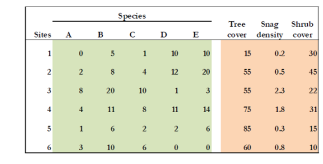


At the opposite of unconstrained ordination, where effect of env. variables can be interpret *a posteriori*, canonical ordination associates two (or more) data sets in the ordination process itself. It formally tests statistical hypotheses about the significance of these relationships

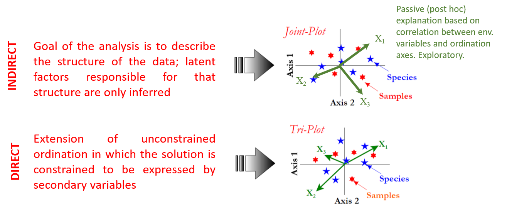


+ In constrained (canonical) ordination analyses, only the variation in the species table that can be explained by the environmental variables is displayed and analyzed, and not all the variation in the species table

+ Gradients are supposed to be known and represented by the measured variable or the combinations, while species abundance or occurrence is considered to be a response to those gradients

+ The aim is to find the best mathematical relationship between species composition and the measure environmental gradients

+ Constrained ordinations are mostly based on **multivariate linear models** relating principal axis to the observed env. variables, and the **different techniques** depend on data types (matrix or table), and on the **hypothesis underlying species distribution in the gradients** (i.e. linear or unimodal)


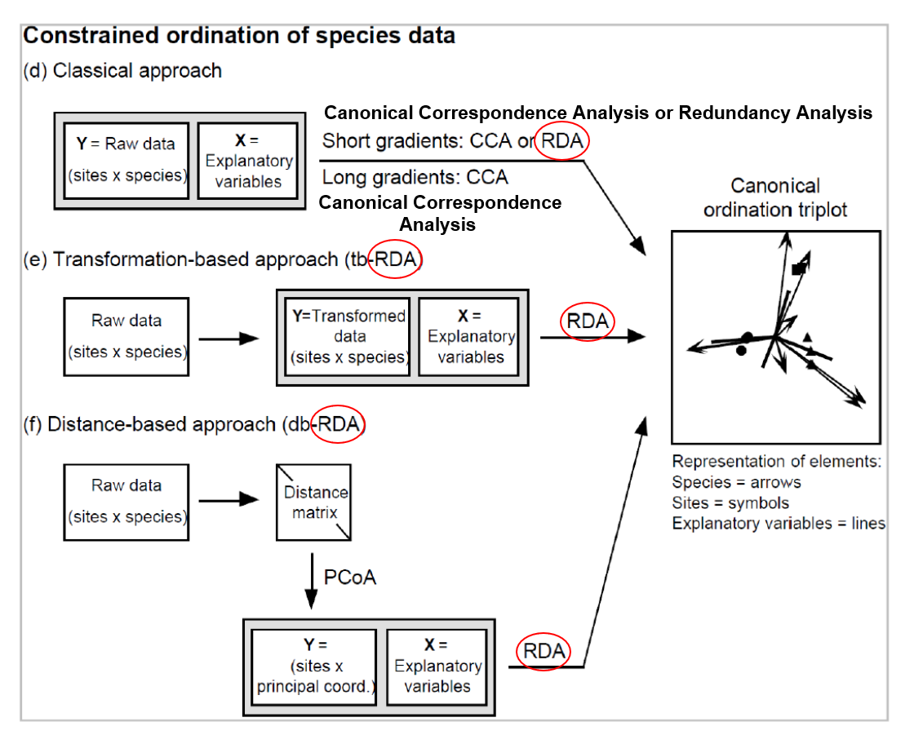

**RDA** has a wide application

### Redundancy Analysis (RDA)

+ **RDA** is a method combining **regression** and **principal component analysis** (direct extension of regression analysis to model multivariate response data)

+ RDA is an extremely **powerful tool** in the hands of ecologists, especially since the introduction of the Legendre and Gallagher (2001) transformations that **open RDA to the analysis of community composition data tables (transformation-based RDA tb-RDA)**

+ RDA = multivariate (meaning multiresponse) multiple linear regression followed by a PCA of the table of fitted values. **Method seeks**, in successive order, a series of linear combinations of the combinations of the **explanatory variables that best explain the variation of the response matrix**.

In RDA, the **number of canonical axes** corresponds to the **number of explanatory variables**, or more precisely to the number of **degrees of freedom**. Each canonical axes corresponds to a **linear combination** (i.e. **multiple regression model**) of all explanatory variables 


#### Computation

In `R`, the `vegan` functions:

+ `rda` perfoms a `rda` if a matrix of environmental variable is supplied (if not it calculates a PCA) 

+ `RsquareAdj` extracts 	the value of R^2^ and adjusted-R^2^ from results of 	ordination (and also regression)

`vegan` allows the computation of an RDA in two different ways.


+ Matrix syntax

The simplest syntax is to list the names of the objects (matrices) involved separated by commas such as:

```{r,  eval=F, message=F}
RDA <- rda (Y, X, W) 
```

where `Y` is the response matrix (**species composition**), `X` is the explanatory matrix (**environmental** factors) and `W` is the matrix of **covariables**.

This is the simplest way, but it does not allow factors (qualitative variables) to be included in the explanatory and covariable matrices.

+ Formula syntax

```{r,  eval=F, message=F}
RDA <- rda (Y ~ var1 + factorA + var2*var3 + Condition (var4), data = XW)
```

In this example, the explanatory variables used are a quantitative variable `var1`, categorical variable `factorA`,and interaction term between `var2` and `var3`, whereas `var4` is used as covariable and idnetified to partially removed its effects.    

#### Examples (`doubs` data)


##### Data preparation

```{r,  eval=T, message=F}
# import the data
data (doubs)
spe <- doubs$fish
env <- doubs$env
spa <- doubs$xy 
# remove empty site 8
spe<-spe[-8,]
env<-env[-8,]
# set aside the variable 'dfs' (distance from the source) for later use
dfs<-env[,1]
#remove the 'dfs' variable from the env dataset
env<-env[,-1]
#recode the slope variable (slo) into a factor (qualitative) variable (to show how these are handled in the ordinations)
slo2<-rep('very_steep',nrow(env))
slo2[env$slo<=quantile(env$slo)[4]] = 'steep'
slo2[env$slo<=quantile(env$slo)[3]] = 'moderate'
slo2[env$slo<=quantile(env$slo)[2]] = 'low'
slo2 <- factor(slo2,levels=c('low','moderate','steep','very_steep'))
# create an env2 data frame with slope as a qualitative variable
env2<-env
env2$slo<-slo2
# create two subsets of explanatory variables
# Physiography (upstream-downstream gradient
envtopo<-env[,c(1:3)] # names(envtopo), covariate matrix isolated form env
# water quality 
envchem <- env[,c(4:10)] # names(envchem), env. matrix isolated form env
# Hellinger-transform the species dataset
spe.hel<-decostand(spe,'hellinger') # spe matrix
```

##### `rda`

Same kind of formula as used in `lm` and other R functions devoted to regression. Check `?rda` for details.


```{r,  eval=T, message=F, results='hide'}
spe.rda <- rda(spe.hel~.,env2) 
summary (spe.rda) # scaling 2 (default)
```

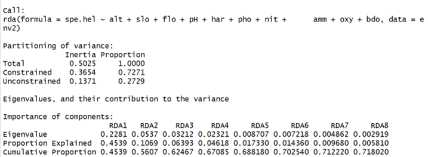

+ **Partitioning of variance**: variance of Y explained by the X variables (constrained proportion, 72.71% here), the unexplained variance of Y (unconstrained proportion, 27.29% here). This R^2^ is biased. 

+ **Eigenvalues and their contribution**: Summarize the eigenvalues, the proportions explained and the cumulative proportion of each canonical axis (each canonical axis = each constraining variable, in this case, the environmental variables from env). Cumulative proportion give the biased R^2^.

+ **Accumulated constrained eigenvalues**: these are cumulative amounts of variance expressed as proportions of the total *explained* variance, as opposed to their contribution to the *total* variance described before

+ **Species scores**: coordinates of the tips of the vector representing the response variables in the bi- or tri- plots. Depending on the scaling chosen

+ **Site scores**: coordinates of the sites as expressed in the space of the response variables Y

+ **Site constraints**: coordinates of the sites in the space of the explanatory variable X. Fitted site scores

+ **Biplot scores**:  coordinates of the tips of the vectors representing explanatory variables. Correlations based. For factors, representation of the centroids of the levels is preferable.

+ **Centroids for factor constraints**: coordinates of centroids of levels of factor variables, i.e. means of the scores of the sites possessing state '1' for a given level.


In the `rda` output, an interesting information is missing: the canonical coefficients, *i.e.* the **equivalent of regression coefficients for each explanatory variable on each canonical axis**. They can be retrieved using `coef`:

```{r,  eval=T, message=F}
coef(spe.rda)
```

In addition like the ordinary R^2^ from multiple regression the R^2^ is biased. It can be cure by adjusting the R^2^ using Ezekiel's formula (Ezekiel 1930). An adjusted R^2^  near 0 indicates that X does not explain more of the variation of Y than random normal variables would do. It can be negative, indicating that the explanatory variables X do worse than random normal variable would. The R^2^ and adjusted-R^2^ can be computed using vegan's function `RsquareAdj` 

```{r,  eval=T, message=F}
#Retrieval of the adjusted R2
# Unadjusted R2 retrieve from RDA results
R2<-RsquareAdj(spe.rda)$r.squared
# Adjusted R2 retrieve from RDA object
R2adj<-RsquareAdj(spe.rda)$adj.r.squared
```

**Plots**

We can call this a triplot since there are three different entities in the plot: sites, response variables and explanatory variables. To differentiate the latter two, it is good to draw arrowhead only on the vector of the quantitative explanatory variables, not on the response variable vectors

```{r,  eval=T, message=F}
# triplot of the rda results
par(mfrow = c(2, 2))

# site scores are weighted by sum of species
# scaling 1: distance triplot
plot (spe.rda, scaling=1, main='Triplot RDA spe.hel ~ env – scaling 1 – wa scores')
spe.sc <- scores (spe.rda, choices=1:2, scaling=1, display='sp') 
arrows (0,0, spe.sc[,1],spe.sc[,2],length=0,lty=1,col='red') 

# scaling 2 (default)
plot (spe.rda,main='Triplot RDA spe.hel ~ env – scaling 2 – wa scores')
spe2.sc <- scores (spe.rda, choices=1:2, display='sp')
arrows (0,0, spe2.sc[,1],spe2.sc[,2],length=0,lty=1,col='red')

# site scores are linear combinations of the environmental variables
# scaling 1
plot (spe.rda,scaling=1,display=c('sp','lc','cn'),main='Triplot RDA spe.hel ~ env – scaling 1 – lc scores')
arrows (0,0, spe.sc[,1],spe.sc[,2],length=0,lty=1,col='red')
# scaling 2
plot (spe.rda,display=c('sp','lc','cn'),main='Triplot RDA spe.hel ~ env – scaling 2 – lc scores') # cn for centroids
arrows (0,0, spe2.sc[,1],spe2.sc[,2],length=0,lty=1,col='red')
```

**Interpretation**

+ Interpretation of the two scaling

  + For the species and the sites the interpretation of the two scalings in the same as in PCA
  
  + Presence of vectors and centroids of explanatory variables call for additional rules
  
+ Let interpret our two last triplots:

  + First two canonical axis alone explaining 58.3% of the total variance of the data, the first axis alone explaining 47.6% (unadjusted values)

  + Since R^2^-adj  = 0.5320, the percentages of accumulated constrained eigenvalues show that the first axis alone explains 0.5224 x 0.643 = 0.336  or 33.6% variance, and the two first 0.5224 x 0.788 = 0.412 or 41.2%
  
  + Major trends have been modelled in this analysis ! In ecology, data are quite noisy, so you should never expect a very high value of R2 adj 


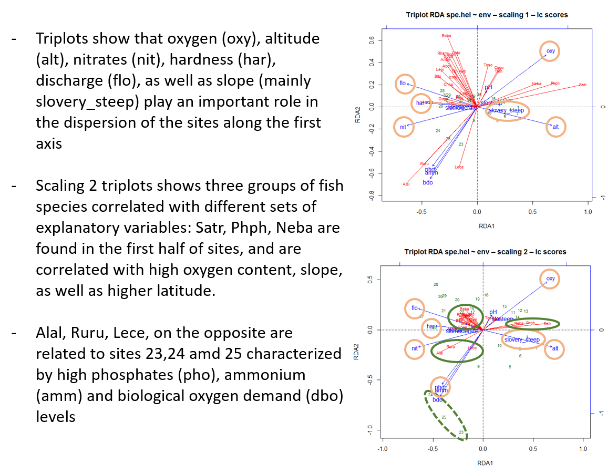

**Overall test**

The overall test function is called `anova.cca`. This name is unfortunate, since it leads to confusion with the classical ANOVA test, which it is not !

```{r,  eval=T, message=F}
# Global test of the RDA results
anova.cca(spe.rda,step=1000)
```

The test of the axes can only be run with the formula synthax. How many canonical axes are significant?

```{r,  eval=T, message=F}
# Test of all canonical axes
anova.cca(spe.rda,by='axis',step=1000)
```

##### Partial `rda`

+ **Partial canonical ordination** is the multivariate equivalent of partial linear regression: it is possible to run a RDA of a (transformed) plant species data matrix **Y**, explained by a matrix of climatic variables **X**, in the presence of soil covariables **W**. Display the patterns of the species data uniquely explained by a linear model of the climatic variables when the effect of the soil is held constant

+ Let's play with the two objects containing subsets of environmental variables: physiographical variables (`envtopo`), i.e. altitude, slope (orginal one not qualitative), and flow / water chemistry (`envchem`) i.e, pH, hardness, phosphates, nitrates, ammonium, oxygen content as well as biological oxygen demand

*Does water chemistry significantly explain the fish species pattern when the effect of the topographical gradient is held constant?*

```{r,  eval=T, message=F, results='hide'}
# Partial RDA: effect of water chemistry, holding physiography constant

# simple interface; X and W may be separate tables of quantitative variales

spechem.physio <- rda(spe.hel,envchem,envtopo)
spechem.physio
summary(spechem.physio)

# formula interface; X and W must be in the same data fram
class(env)
spechem.physio2<-rda(spe.hel~pH+har+pho+nit+amm+oxy+bdo+Condition(alt+slo+flo), data=env)
spechem.physio2
summary(spechem.physio2)

# the results of the two analyses are identical
# check in the output: four components in the partitioning variance instead of 3

# Test of the partial RDA (using the results with the formula interface to allow the tests of the axes to be run)

anova.cca(spechem.physio2,step=1000)
anova.cca(spechem.physio2,step=1000,by='axis')

# partial RDA triplots (with fitted site score)
par(mfrow=c(1,2))
#scaling 1
plot(spechem.physio,scaling=1,display=c('sp','lc','cn'), main='Triplot RDA spe.hel ~ chem | topo – scaling 1 – lc scores')
spe3.sc <- scores(spechem.physio,choices=1:2,scaling=1, display='sp')
arrows(0,0,spe3.sc[,1],spe3.sc[,2],length=0,lty=1,col='red')

#scaling 2
plot(spechem.physio,display=c('sp','lc','cn'), main='Triplot RDA spe.hel ~ chem | topo – scaling 2 – lc scores')
spe4.sc <- scores(spechem.physio,choices=1:2,display='sp')
arrows(0,0,spe4.sc[,1],spe4.sc[,2],length=0,lty=1,col='red')
```

The result of this partial analysis differs somewhat from the previous results but not fundamentally. `har` and `nit` are less important in explaining the fish community structure. This may be due to the fact that these two variables are well correlated with the position along the river.

##### Forward selection of explanatory variables

+ It happens we wish to reduce the number of explanatory variables. The reasons vary: search for parsimony, rich data set but poor at priori hypotheses, or a method producing a large set of explanatory variables which must be reduced afterwards. 

+ In `doubs` data, there could be two reasons to reduce the number of explanatory variables: search for parsimony, and possible strong linear dependencies (correlations) among the explanatory variables in the RDA model

+ Linear dependencies can be explored by computing the variables' variance inflation factor. VIFs above 20 indicates strong collinearity. Ideally, VIFs above 10 should be at least examined, and avoid if possible. VIFs can be computed in `vegan` after `rda` or `cca` using the function `vif.cca`


```{r,  eval=T, message=F}
# Variance inflation factor (VIF) in two RDAs 
# First RDA: all environmental variables
vif.cca(spe.rda)
# Second RDA: subset of environmental variables
vif.cca (spechem.physio)
# A reduction is justified !!!
```

To select the significant explanatory variables, you can then perform a stepwise selection (forward or backward), using the `ordistep` or `ordiR2step` function (or using the `forward.sel` function of package `packfor`)

```{r,  eval=T, message=F, results='hide'}
# Forward selection using ordistep() function. This function allows the use of factors. Options are also available for stepwise and backward selection of the explanatory variables
spe.rda.all<-rda(spe.hel~.,data=env)
step.forward1 <- ordistep(rda(spe.hel~1,data=env), scope=formula(spe.rda.all),direction='forward',pstep=1000)
step.forward2 <- ordiR2step(rda(spe.hel~1,data=env), scope=formula(spe.rda.all),direction='forward',pstep=1000)
```

These analyses show that the most parsimonious attitude would be to settle a model containing only three variables: altitude, oxygen, and biological  oxygen demand

##### Parsimonious RDA

```{r,  eval=T, message=F, results='hide'}
spe.rda.pars <- rda(spe.hel~alt+oxy+bdo, data=env)
spe.rda.pars
anova.cca(spe.rda.pars,step=1000)
anova.cca(spe.rda.pars,step=1000,by='axis')
vif.cca(spe.rda.pars)
R2a.pars <- RsquareAdj(spe.rda.pars)$adj.r.squared
```

```{r,  eval=T, message=F, results='hide'}
# Triplots of the parsimonious RDA (with fitted site scores)
# scaling 1

plot(spe.rda.pars,scaling=1,display=c('sp','lc','cn'),main='Triplot RDA spe.hel ~ alt+oxy+bdo – scaling 1 – lc scores')
spe4.sc <- scores(spe.rda.pars, choices=1:2, scaling=1,display='sp')
arrows(0,0,spe4.sc[,1],spe4.sc[,2],length=0,lty=1, col='red')

# scaling 2

plot(spe.rda.pars, display=c('sp','lc','cn'),main='Triplot RDA spe.hel ~ alt+oxy+bdo – scaling 2 – lc scores')
spe5.sc <- scores(spe.rda.pars, choices=1:2,display='sp')
arrows(0,0,spe5.sc[,1],spe5.sc[,2],length=0,lty=1, col='red')

# since there is now a third significant canonical axis, you could compute other combinations: axes 1 and 3, axes 2 and 3
```

##### Variation partitioning

+ Variation partitioning is a type of analysis that combines RDA and partial RDA to divide the variation of a response variable among two, three or four explanatory data sets.

+ Variation partitioning are generally represented by Venn diagram in which the percentage of explained variance by each explanatory data set (or combination of data stets) is reported. 

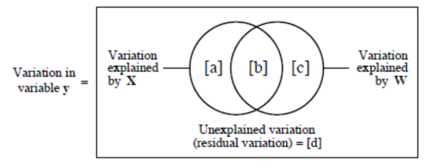


```{r,  eval=T, message=F}
# Variation partitioning with two sets of explanatory variables
# and all explanatory variables
showvarparts(2)# explanation fraction labels for two explanatory matrices
spe.part.all <- varpart(spe.hel,envchem,envtopo)
spe.part.all
plot(spe.part.all, digits=2)
```

The first partitioning shows that both sets of expl. variables contribute to the explanation of the species data. The unique contribution of the chemical variables (fraction [a], R2adj=0.229) is much larger than that of the physiography (R2adj=0.081). The variation explained jointly by the two sets (fraction [b], R2adj=0.245) is also large. This indicates that the chemical and physiographic variables are intercorrelated => good reason for parsimony


### db-RDA

+ Distance-based Redundancy analysis

Community composition data must be transformed before they are used: chord, Hellinger, etc. Ecologist may want to compute RDA based on other dissimilarity measures that cannot be computed by a data transformation followed by the calculation of the Euclidean distance: db-RDA

+ Function `capscale` from `vegan`

```{r,  eval=T, message=F, results='hide'}
# distance-based redundancy analysis
spe.bray <- vegdist (spe,'bray')
#response matrix can be raw data
dbrda1<-capscale(spe~pH+har+pho+nit+amm+oxy+bdo+ Condition(alt+slo+flo), distance='bray', data=env,add=T) 
# response matrix can be a dissimilarity matrix
dbrda2<-capscale(spe.bray~pH+har+pho+nit+amm+oxy+bdo+ Condition(alt+slo+flo), distance='bray', data=env,add=T) 
```

### CCA ##

Pending


